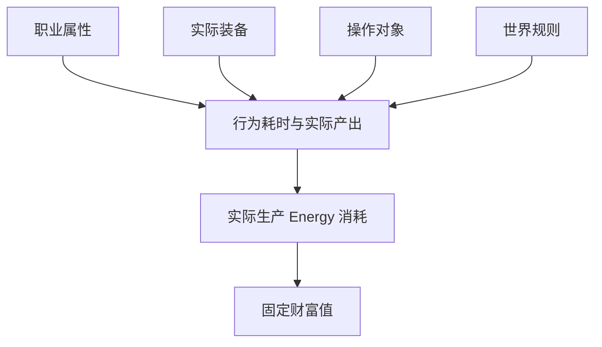
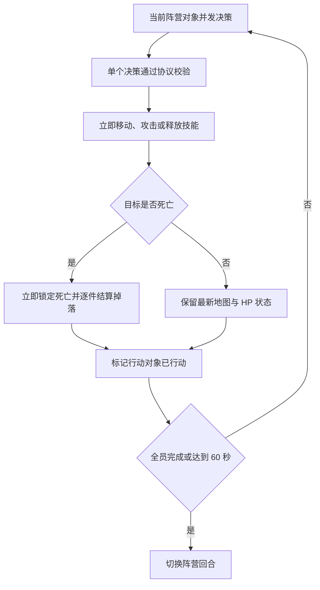

# Lumiterra 数值内核

## 文档阅读方式

本文档使用固定格式区分不同类型的信息：

| 格式 | 用途 |
|---|---|
| **规则** | 说明必须遵守的游戏逻辑 |
| **公式** | 说明可直接实现为程序或合约的计算关系 |
| **基础数值** | 列出公式使用的常量、范围和 Lv1–9 数值表 |
| **操作流程** | 说明规则在程序中的执行顺序 |
| **例子** | 只用来帮助理解，不会引入新规则 |

## 1. 数值范围

本文档定义游戏最底层的价值转换过程：

### 操作流程｜底层价值转换


本文档同时定义三职业共用的回合与伤害公式。以下内容仍由各自系统模块定义：

- 各等级角色、操作对象与装备的具体属性数值；
- AI、Gas 等运行 Energy；
- 免费试玩与待激活状态的完整业务流程；
- 配方名称、装备槽位、工作台分布、奖池、Token、回收和借贷。

## 2. 基础规则

### 2.1 Energy 本身没有等级

Energy 始终是同一种资产。等级属于物品、装备、操作对象和生产行为，不存在 Lv1 Energy、Lv9 Energy 等不同币种。Agent 不设置用于穿戴或资格判断的角色等级，只保存用于基础属性成长的阶段。

### 2.2 生产 Energy 由实际产出决定

不配置固定的 Energy/秒、Energy/小时或每日生产 Energy 上限。只有实际产出完成激活时，才根据物品数量与等级结算生产 Energy；生成未激活产出时暂不扣除。

#### 公式｜生产 Energy

```text
TotalProductionEnergy
= Σ（实际获得数量 × ActualEnergyCost(ActiveProductionLevel, ItemLevel)）
```

#### 公式｜空产出

若一次行为没有获得物品：

```text
TotalProductionEnergy = 0
TotalFixedWealth = 0
```

空掉落只影响实际产出数量，不修改单件物品的 Energy 成本或财富转化率。

### 2.3 时间效率独立于 Energy → 财富值结算

时间效率不属于 Energy → 财富值公式，也不额外设置统一的 Energy 吞吐上限。三职业统一使用回合与伤害公式；装备属性、目标属性、行动间隔和世界规则共同决定实际完成时间。

实际玩法时间叠加职业模块中的回合、移动、刷新和并行生产等规则。种田没有成长或成熟等待状态。

#### 操作流程｜从职业属性到生产结算



#### 例子｜高等级装备攻击低等级怪物

> 穿戴 Lv9 战斗装备的角色通常可以更快击杀 Lv1 怪物，因此单位时间获得更多 Lv1 掉落并消耗更多生产 Energy。但这些掉落仍然属于 Lv1 物品。

### 2.4 固定物品财富值与 Agent 转化效率

每个等级的基础生产物品拥有固定财富值，不因生产者改变。财富转化率读取当前行为的有效生产等级 `ActiveProductionLevel`，该等级只由当前职业装备决定。

有效生产等级与物品等级相同时，使用该等级的基准 Energy 成本。低等级装备跨级生产高等级物品时，因为财富转化率更低，需要投入更多 Energy 才能获得同一个固定财富值。

精华和装备属于合成产物，其固定财富值不再套用普通单件物品公式，而是继承被销毁输入物的固定财富值，见第 11.2 节。

### 2.5 Agent 成长阶段不限制装备

Agent 不设置装备资格等级，任意成长阶段都可以穿戴任意等级的装备和工具。协议仍保存 Lv1–9 成长阶段，但该阶段只用于计算 Agent 的基础 HP、移动范围和背包容量。

伤害与财富转化继续读取实际装备确定的有效生产等级。成长阶段不进入攻击、防御、暴击率或财富转化公式。

#### 规则｜行为与有效生产等级的映射

| 当前行为 | `ActiveProductionLevel` |
|---|---|
| 战斗 | `EquippedSwordLevel` |
| 采集 | `EquippedAxeLevel` |
| 种田 | `EquippedWateringCanLevel` |

战斗、采集和种田分别只读取剑、斧头和水壶的等级。未装备对应武器时不能发起该类型遭遇；装备等级不受 Agent 成长阶段限制，其他类型的武器不参与本次结算。

## 3. 核心名称

公式优先使用完整英文名称，不使用单字母缩写。

| 名称 | 含义 |
|---|---|
| `AgentGrowthStage` | Agent 共享成长阶段，取值 1–9；不作为装备门槛 |
| `AgentGrowthProgress` | 当前成长阶段累计获得的有效成长掉落数量 |
| `GrowthEligibleAtProduction` | 掉落分配对象是否为 Agent 且满足成长资格；写入后不可修改 |
| `ActiveProductionLevel` | 当前行为只由实际装备确定的有效生产等级，取值 1–9 |
| `TargetLevel` | 怪物、采集节点或作物等操作对象的等级，取值 1–9 |
| `ItemLevel` | 实际产出物品的等级，取值 1–9 |
| `ActualOutputQuantity` | 逐件分配后归属参与对象且未被销毁的物品数量；包含 Agent 待领取战利品 |
| `SameLevelEnergyCost(ItemLevel)` | 同等级装备生产一件该等级物品时的基准 Energy |
| `WealthConversionRate(ActiveProductionLevel)` | 当前装备将生产 Energy 转化为财富值的效率 |
| `FixedItemWealth(ItemLevel)` | 一件该等级基础生产物品固定拥有的财富值 |
| `CraftedItemFixedWealth(OutputItem)` | 一件合成产物继承的固定财富值 |
| `ActualEnergyCost(ActiveProductionLevel, ItemLevel)` | 当前装备获得一件指定等级物品实际消耗的 Energy |
| `Attack` | 当前职业最终攻击力 |
| `Defense` | 当前职业最终防御力 |
| `CriticalChance` | 当前职业最终暴击率 |
| `Health` | 三职业共享的当前生命值 |
| `MaximumHealth` | 当前成长阶段决定的生命值上限 |
| `HealthMultiplier(AgentGrowthStage)` | 当前成长阶段的基础 HP 倍率 |
| `MoveRange(AgentGrowthStage)` | 当前成长阶段允许移动的格子半径 |
| `CastRange` | 技能从施法者到目标对象或目标格的最大格子半径 |
| `EffectRadius` | 格子 AOE 以目标格为中心的影响半径 |
| `SkillCoefficient` | 技能对攻击力的倍率 |
| `BackpackCapacity(AgentGrowthStage)` | 当前成长阶段的背包容量 |
| `ItemWeight(Item)` | 单件物品占用的背包容量，默认值为 1 |
| `BackpackUsedCapacity` | 背包中所有物品的数量乘单件重量之和 |
| `NetEquipmentUpgradeCostEnergy` | 制作并换用下一等级装备的净 Energy 等价成本 |
| `EnergySavedPerNewLevelItem` | 下一等级装备生产一件下一等级物品时，相对旧装备节省的 Energy |
| `BreakEvenNewLevelOutputCount` | 收回装备升级净成本所需生产的下一等级物品数量 |

## 4. 单件生产 Energy 成本

单件生产 Energy 成本采用指数增长，每两级翻倍：

### 公式｜同级单件 Energy 成本

```text
SameLevelEnergyCost(ItemLevel)
= 2^((ItemLevel - 1) / 2)
```

该公式使每一级的同级基准成本固定增长约 41.4%，Lv9 同级基准成本是 Lv1 的 16 倍。

### 基础数值｜Lv1–9 同级单件 Energy 成本

| 等级 | 单件 Energy 成本 |
|---:|---:|
| Lv1 | 1.000000 |
| Lv2 | 1.414214 |
| Lv3 | 2.000000 |
| Lv4 | 2.828427 |
| Lv5 | 4.000000 |
| Lv6 | 5.656854 |
| Lv7 | 8.000000 |
| Lv8 | 11.313708 |
| Lv9 | 16.000000 |

## 5. 财富转化率

Lv1 财富转化率为 70%，Lv9 为 95%，中间等级采用线性关系：

### 公式｜财富转化率

```text
WealthConversionRate(ActiveProductionLevel)
= 70% + 25% × (ActiveProductionLevel - 1) / 8
```

### 基础数值｜Lv1–9 财富转化率与经济折损率

| 等级 | 财富转化率 | 经济折损率 |
|---:|---:|---:|
| Lv1 | 70.000% | 30.000% |
| Lv2 | 73.125% | 26.875% |
| Lv3 | 76.250% | 23.750% |
| Lv4 | 79.375% | 20.625% |
| Lv5 | 82.500% | 17.500% |
| Lv6 | 85.625% | 14.375% |
| Lv7 | 88.750% | 11.250% |
| Lv8 | 91.875% | 8.125% |
| Lv9 | 95.000% | 5.000% |

## 6. 财富值结算

一件基础生产物品的财富值只由物品等级决定，实际 Energy 成本同时读取物品等级与当前有效生产等级。精华和装备的固定财富值按第 11.2 节的合成财富守恒公式计算。

### 公式｜单件物品的财富值与实际 Energy

```text
FixedItemWealth(ItemLevel)
= SameLevelEnergyCost(ItemLevel)
× WealthConversionRate(ItemLevel)

ActualEnergyCost(ActiveProductionLevel, ItemLevel)
= FixedItemWealth(ItemLevel)
÷ WealthConversionRate(ActiveProductionLevel)

= SameLevelEnergyCost(ItemLevel)
× WealthConversionRate(ItemLevel)
÷ WealthConversionRate(ActiveProductionLevel)
```

当 `ActiveProductionLevel = ItemLevel` 时，实际 Energy 成本等于同级基准 Energy 成本。低等级装备跨级获得高等级物品时，会因为转化率较低而消耗更多 Energy，但物品财富值不变。

### 例子｜Lv9 战斗装备获得 Lv1 掉落

> Lv1 物品的固定财富值始终为 0.7。使用 Lv1 装备获得它需要 1 Energy，使用 Lv9 装备获得同一件物品只需要 0.736842 Energy。

```text
FixedItemWealth(1)
= 1 × 70%
= 0.7

ActualEnergyCost(1, 1)
= 0.7 ÷ 70%
= 1

ActualEnergyCost(9, 1)
= 0.7 ÷ 95%
= 0.736842
```

| 有效生产等级 | 掉落物品 | 实际 Energy | 固定财富值 |
|---|---|---:|---:|
| Lv1 | Lv1 | 1.000000 | 0.700000 |
| Lv9 | Lv1 | 0.736842 | 0.700000 |

一次行为获得多件物品时：

### 公式｜多件物品结算

```text
TotalProductionEnergy
= Σ（ActualOutputQuantity
  × ActualEnergyCost(ActiveProductionLevel, ItemLevel)）
```

```text
TotalFixedWealth
= Σ（ActualOutputQuantity
  × FixedItemWealth(ItemLevel)）
```

### 例子｜一次获得 2 件 Lv1 物品

> 一次行为实际获得 2 件 Lv1 物品。Lv1 物品的同级单件 Energy 成本为 1，固定财富值为 0.7。

```text
TotalProductionEnergy = 2 × 1 = 2
TotalFixedWealth = 2 × 0.7 = 1.4
```

### 基础数值｜同等级单件产出

| 等级 | 同级 Energy/件 | 职业转化率 | 固定财富值/件 |
|---:|---:|---:|---:|
| Lv1 | 1.000000 | 70.000% | 0.700000 |
| Lv2 | 1.414214 | 73.125% | 1.034144 |
| Lv3 | 2.000000 | 76.250% | 1.525000 |
| Lv4 | 2.828427 | 79.375% | 2.245064 |
| Lv5 | 4.000000 | 82.500% | 3.300000 |
| Lv6 | 5.656854 | 85.625% | 4.843681 |
| Lv7 | 8.000000 | 88.750% | 7.100000 |
| Lv8 | 11.313708 | 91.875% | 10.394470 |
| Lv9 | 16.000000 | 95.000% | 15.200000 |

## 7. 装备效率与升级回本

Agent 成长阶段提升不消耗物品、Energy、财富值或 Token，也不限制装备。本节的“Lv x → Lv x+1 升级”只表示玩家制作并换用下一等级装备；这是玩家可能因为回本过慢而拒绝执行的经济决策。

等级越高，单件物品的同级基准 Energy 成本越高。装备等级提高财富转化率，使玩家能够用更少的 Energy 获得相同财富值。

### 7.1 每 100 Energy 的效率提升

```text
CurrentWealthFrom100Energy
= 100 × WealthConversionRate(CurrentLevel)

NextLevelEnergyForSameWealth
= CurrentWealthFrom100Energy
  ÷ WealthConversionRate(NextLevel)

EnergySavedForSameWealth
= 100 - NextLevelEnergyForSameWealth

RelativeEfficiencyIncrease
= WealthConversionRate(NextLevel)
  ÷ WealthConversionRate(CurrentLevel)
  - 1
```

| 升级 | 旧装备投入 100 Energy 获得财富值 | 新装备获得同财富所需 Energy | 节省 Energy | 相对效率提升 |
|---|---:|---:|---:|---:|
| Lv1 → Lv2 | 70.000 | 95.726 | 4.274 | 4.464% |
| Lv2 → Lv3 | 73.125 | 95.902 | 4.098 | 4.274% |
| Lv3 → Lv4 | 76.250 | 96.063 | 3.937 | 4.098% |
| Lv4 → Lv5 | 79.375 | 96.212 | 3.788 | 3.937% |
| Lv5 → Lv6 | 82.500 | 96.350 | 3.650 | 3.788% |
| Lv6 → Lv7 | 85.625 | 96.479 | 3.521 | 3.650% |
| Lv7 → Lv8 | 88.750 | 96.599 | 3.401 | 3.521% |
| Lv8 → Lv9 | 91.875 | 96.711 | 3.289 | 3.401% |

相邻等级每投入 100 Energy 都固定增加 3.125 财富值，但相对效率提升会从 4.464% 逐步下降至 3.401%。

### 7.2 单件节省与可接受升级成本

```text
CurrentEquipmentEnergyForNewLevelItem
= FixedItemWealth(NextLevel)
  ÷ WealthConversionRate(CurrentLevel)

NextEquipmentEnergyForNewLevelItem
= SameLevelEnergyCost(NextLevel)

EnergySavedPerNewLevelItem
= CurrentEquipmentEnergyForNewLevelItem
  - NextEquipmentEnergyForNewLevelItem

BreakEvenNewLevelOutputCount
= ceil(
    NetEquipmentUpgradeCostEnergy
    ÷ EnergySavedPerNewLevelItem
  )
```

`NetEquipmentUpgradeCostEnergy` 包含被销毁旧装备和材料的 Energy 等价机会成本，并扣除立即返还的价值。执行合成本身不额外消耗 Energy。自产材料按实际生产 Energy 计算；购买材料按实际 MON 成本计算，因为 `1 Energy = 1 MON`。

| 升级 | 新等级物品同级 Energy/件 | 每件节省 Energy | 1,000 件回本的成本上限 | 2,000 件回本的成本上限 |
|---|---:|---:|---:|---:|
| Lv1 → Lv2 | 1.414214 | 0.063135 | 63.135 | 126.269 |
| Lv2 → Lv3 | 2.000000 | 0.085470 | 85.470 | 170.940 |
| Lv3 → Lv4 | 2.828427 | 0.115919 | 115.919 | 231.838 |
| Lv4 → Lv5 | 4.000000 | 0.157480 | 157.480 | 314.961 |
| Lv5 → Lv6 | 5.656854 | 0.214275 | 214.275 | 428.550 |
| Lv6 → Lv7 | 8.000000 | 0.291971 | 291.971 | 583.942 |
| Lv7 → Lv8 | 11.313708 | 0.398370 | 398.370 | 796.740 |
| Lv8 → Lv9 | 16.000000 | 0.544218 | 544.218 | 1,088.435 |

- 推荐线：`NetEquipmentUpgradeCostEnergy` 不高于 1,000 件回本的成本上限，使玩家在下一阶段前半段回本。
- 警戒线：成本位于 1,000–2,000 件回本区间，玩家会在下一阶段后半段回本。
- 失败线：成本高于 2,000 件回本上限，玩家完成整个下一等级阶段仍未回本，存在停留在旧装备的明显动机。

### 7.3 回本测试用例

例：Lv4 → Lv5 装备的净升级成本为 100 Energy：

```text
BreakEvenNewLevelOutputCount
= ceil(100 ÷ 0.157480)
= 635 件 Lv5 物品

BreakEvenActiveHours
= 635 × 2.7 minutes ÷ 60
= 28.58 hours
```

该成本低于 Lv4 → Lv5 的 1,000 件推荐上限 157.480 Energy，因此通过升级吸引力测试。

<details>
<summary>反例：把升级前 2,000 件产出的全部 Energy 视为升级成本</summary>

有效成长掉落只记录 Agent 成长进度，物品和财富值仍归玩家所有，因此生产这 2,000 件物品的全部 Energy 不是装备升级的增量成本。只有实际被合成销毁的部分才能计入 `NetEquipmentUpgradeCostEnergy`。

如果未来改成升级时销毁全部 2,000 件成长掉落，回本结果如下：

| 升级 | 2,000 件旧等级产出的 Energy | 回本所需新等级物品 |
|---|---:|---:|
| Lv1 → Lv2 | 2,000.000 | 31,679 件 |
| Lv2 → Lv3 | 2,828.427 | 33,093 件 |
| Lv3 → Lv4 | 4,000.000 | 34,507 件 |
| Lv4 → Lv5 | 5,656.854 | 35,922 件 |
| Lv5 → Lv6 | 8,000.000 | 37,336 件 |
| Lv6 → Lv7 | 11,313.708 | 38,750 件 |
| Lv7 → Lv8 | 16,000.000 | 40,164 件 |
| Lv8 → Lv9 | 22,627.417 | 41,578 件 |

该方案在所有等级都远高于 2,000 件失败线，会使玩家拒绝升级，因此不能作为装备升级成本设计。

</details>

### 7.4 实际每小时财富值

实际每小时财富值不设置固定等级倍率，由职业动作、掉落、装备、操作对象和世界规则共同推导：

```text
ActualWealthPerHour
= Σ（ActualOutputQuantityPerHour
  × FixedItemWealth(ItemLevel)）
```

## 8. 统一战棋遭遇与伤害

战斗、采集和种田共用同一套有限地图、阵营回合、移动、技能、HP、伤害与逐件掉落公式。类型只决定读取哪组职业属性、武器、敌方配置和掉落表。

### 8.1 属性与武器映射

| 当前行为 | 攻击 | 防御 | 暴击率 | 武器 | 敌方对象 |
|---|---|---|---|---|---|
| 战斗 | `CombatAttack` | `CombatDefense` | `CombatCriticalChance` | 剑 | 怪物 |
| 采集 | `GatherAttack` | `GatherDefense` | `GatherCriticalChance` | 斧头 | 采集物 |
| 种田 | `FarmAttack` | `FarmDefense` | `FarmCriticalChance` | 水壶 | 作物或农田对象 |

角色和敌方对象都使用相同的 HP、攻击、防御、暴击率和技能字段。`Health` 在三种遭遇之间共享，不能通过切换类型恢复。

### 8.2 地图、移动与回合参数

```text
FriendlyFirstChance = 50%
EnemyFirstChance = 50%
FactionTurnMaximumDuration = 60 seconds
EncounterMaximumDuration = 30 minutes

MapWidth = EncounterConfig.MapWidth
MapHeight = EncounterConfig.MapHeight

CanMoveToGrid
= HorizontalDistance² + VerticalDistance²
  <= UnitMoveRange²
```

- 遭遇地图长宽有限，但同一格允许任意数量的友方或敌方对象堆叠。
- 遭遇开始时使用协议随机数决定先手阵营，一个完整轮次由友方和敌方各一个阵营回合组成。
- 同阵营对象并发决策；每个有效决策按协议确认顺序立即执行，不等待阵营回合结束。
- 当前阵营所有对象完成行动，或阵营回合达到 60 秒时切换阵营；超时未行动对象自动待机。
- 新加入对象生成在友方地图边界，从下一个友方回合开始获得行动机会。

### 8.3 技能与伤害公式

#### 基础数值｜技能与伤害常量

```text
DefenseScale = 100
MinimumDamage = 1
NormalSkillCoefficient = 100%
NormalDamageMultiplier = 100%
MinimumCriticalMultiplier = 100%
MaximumCriticalMultiplier = 200%
MaximumCriticalChance = 50%
FriendlyFireEnabled = false
```

每个技能配置：

```text
CastRange
SkillCoefficient
EffectRadius
IsGridAOE
```

`CastRange` 限制施法者与目标对象或目标格的距离；`EffectRadius` 限制目标格周围的效果范围。单体技能选择具体对象，格子 AOE 对范围内全部敌方对象分别执行一次伤害公式，永远不伤害友方。

```text
CanCastAtGrid
= CastHorizontalDistance² + CastVerticalDistance²
  <= CastRange²

IsInsideEffectRadius
= EffectHorizontalDistance² + EffectVerticalDistance²
  <= EffectRadius²
```

#### 公式｜单个目标伤害

```text
EffectiveCriticalChance
= clamp(AttackerCriticalChance, 0%, MaximumCriticalChance)

EffectiveSkillAttack
= floor(AttackerAttack × SkillCoefficient)

BaseDamage
= max(
    MinimumDamage,
    floor(
      EffectiveSkillAttack × DefenseScale
      ÷ (DefenseScale + DefenderDefense)
    )
  )

IsCritical
= RandomBasisPoints(ActionSeed, ActionId, DefenderId, "critical-hit")
  < EffectiveCriticalChance

MinimumCriticalDamage
= floor(BaseDamage × MinimumCriticalMultiplier)

MaximumCriticalDamage
= floor(BaseDamage × MaximumCriticalMultiplier)

FinalDamage
= IsCritical
  ? RandomInteger(
      ActionSeed,
      ActionId,
      DefenderId,
      "critical-damage",
      MinimumCriticalDamage,
      MaximumCriticalDamage
    )
  : floor(BaseDamage × NormalDamageMultiplier)

DefenderHealthAfterHit
= max(0, DefenderHealthBeforeHit - FinalDamage)
```

普通攻击使用 `NormalSkillCoefficient = 100%`。`ActionSeed` 必须来自协议认可的随机数来源；AOE 对不同目标使用 `DefenderId` 隔离随机结果。所有属性和伤害使用非负整数，百分比在程序中使用基点表示。

<details>
<summary>期望伤害与示例</summary>

暴击倍率在 100%–200% 均匀分布时，平均暴击倍率为 150%：

```text
ExpectedDamagePerHit
= BaseDamage
  × [1 + EffectiveCriticalChance × (150% - 100%)]

ExpectedActionsToDefeat
= ceil(TargetHealth ÷ ExpectedDamagePerHit)
```

攻击 150、防御 50、技能系数 100%、暴击率 20% 时，普通伤害为 100，暴击伤害范围为 100–200，期望单次伤害为 110。

</details>

### 8.4 行动状态与即时执行



- 每个对象每个阵营回合只有一次正式行动；可以先移动，再攻击、释放技能、待机或撤离。
- 正式行动确认前可以不限次数更换实际携带的装备和使用血瓶，这些准备操作不消耗移动或正式行动。
- 已选目标在行动确认前死亡时，校验失败且对象不记为已行动，可以在剩余时间内重新决策。
- 友方对象只有位于地图边界时才能撤离；敌方对象不能撤离。

### 8.5 多人有效伤害与逐件掉落

每个敌方对象独立累计伤害，最后一击的溢出伤害不增加掉落权重：

```text
ValidDamage(Participant, Target, Hit)
= min(FinalDamage, TargetHealthBeforeHit)

ParticipantValidDamage(Participant, Target)
= Σ ValidDamage(Participant, Target, Hit)

DamageShare(Participant, Target)
= ParticipantValidDamage(Participant, Target)
  ÷ Σ AllParticipantsValidDamage(Target)

NormalDropEligible(Participant, Target)
= ParticipantValidDamage(Participant, Target) > 0

RareDropMinimumDamageShare = 5%

RareDropEligible(Participant, Target)
= DamageShare(Participant, Target)
  >= RareDropMinimumDamageShare

DropWinner(Target, DropEntry, ItemUnitIndex)
= RandomWeightedChoice(
    ActionSeed,
    TargetId,
    DropEntry,
    ItemUnitIndex,
    "drop-owner",
    EligibleParticipantValidDamage
  )
```

- 对象死亡后先生成掉落表结果，再把每个掉落数量拆成单件物品；每一件分别执行一次 `DropWinner`。
- 普通掉落读取 `NormalDropEligible`，稀有掉落读取 `RareDropEligible`，两者都以该对象的有效伤害作为随机权重。
- 已死亡或撤离的参与对象保留对该目标的有效伤害与掉落资格。
- 同一人类账户的宠物和多个 Agent 各自参与计算，不合并伤害或随机权重；账户总期望概率仍等于其参与对象伤害占比之和。
- 随机结果使用协议随机数来源并按目标、掉落项和物品序号隔离，客户端不能指定结果。

<details>
<summary>掉落接收与背包容量</summary>

```text
AgentPendingEncounterLoot
= WinnerIsAgent
  and (WinnerExitedEncounter or CanReceiveItems = false)

PetDropDestroyed
= WinnerIsPet
  and IncomingItemWeight > PetBackpackRemainingCapacity
```

- Agent 已死亡、撤离或背包容量不足时，归属不变，物品留在遭遇地点的待领取战利品中；该 Agent 返回且容量足够后领取。
- 宠物背包容量固定为 2。宠物容量足够时物品直接进入宠物背包；容量不足时该件物品消失，不重新抽取，并在界面提示容量风险。
- 宠物获得的物品不为任何 Agent 增加成长进度；只有 Agent 自己抽中且满足资格的掉落进入该 Agent 成长计算。

</details>

### 8.6 完成时间与产量

`ExpectedActionsToDefeat` 见第 8.3 节。实际每小时产量与财富值必须通过地图大小、移动范围、双方技能、阵营回合、参与人数、决策时间、目标数量、刷新和逐件掉落共同模拟，再代入第 7.4 节公式。三种遭遇不再使用独立工作量或固定 `ActionInterval` 公式。

### 8.7 死亡、撤离与超时

- 友方对象 HP 归零时立即退出遭遇，但保留已有有效伤害与掉落资格。
- 位于地图边界的友方对象可以用正式行动撤离；撤离后不能重新加入同一遭遇，但保留已有有效伤害与掉落资格。
- 敌方对象 HP 归零时立即锁定死亡并结算其掉落，不等待其他敌方对象。
- 到达 30 分钟上限时完成当前执行中的行动，不再接受新行动；已死亡对象的掉落保留，存活敌方对象不掉落并恢复初始状态。
- 行为过程中已经发生的 Gas、模型调用和 Agent 运行 Energy 不因死亡、撤离或超时退还。

## 9. 职业属性与装备接口

装备可以自由混搭，不要求完整职业套装。Agent 可以穿戴任意等级的装备和工具，成长阶段不参与穿戴验证。

成长阶段只决定 Agent 的基础 HP、移动范围和背包容量。装备提供各职业的攻击、防御和暴击率，但不能提供 HP。

### 公式｜最终属性

```text
FinalAttribute(Profession)
= FixedBaseAttribute(Profession)
+ Σ EquippedItemAttribute(Profession)
```

### 规则｜三职业属性

| 职业 | 最终属性 |
|---|---|
| 战斗 | `CombatAttack`、`CombatDefense`、`CombatCriticalChance` |
| 采集 | `GatherAttack`、`GatherDefense`、`GatherCriticalChance` |
| 种田 | `FarmAttack`、`FarmDefense`、`FarmCriticalChance` |

`Health` 为共享属性：

```text
MaximumHealth
= FixedBaseHealth
  × HealthMultiplier(AgentGrowthStage)

FinalMoveRange
= MoveRange(AgentGrowthStage)

FinalBackpackCapacity
= BackpackCapacity(AgentGrowthStage)
```

成长阶段在生产结算完成后更新；阶段提升时重新计算 `MaximumHealth`，但当前 `Health` 保持不变，因此阶段提升不会产生免费治疗。

```text
HealthMultiplier(AgentGrowthStage)
= 1 + 0.5 × (AgentGrowthStage - 1)

MoveRange(AgentGrowthStage)
= 4 + AgentGrowthStage

BackpackCapacity(AgentGrowthStage)
= round(
    10 × 100^((AgentGrowthStage - 1) / 8)
  )
```

### 基础数值｜Agent 成长属性

| 成长阶段 | 基础 HP 倍率 | 移动范围 | 背包容量 |
|---:|---:|---:|---:|
| Lv1 | 1.0× | 5 格 | 10 |
| Lv2 | 1.5× | 6 格 | 18 |
| Lv3 | 2.0× | 7 格 | 32 |
| Lv4 | 2.5× | 8 格 | 56 |
| Lv5 | 3.0× | 9 格 | 100 |
| Lv6 | 3.5× | 10 格 | 178 |
| Lv7 | 4.0× | 11 格 | 316 |
| Lv8 | 4.5× | 12 格 | 562 |
| Lv9 | 5.0× | 13 格 | 1,000 |

背包容量使用指数曲线，是因为 10–1,000 的跨度达到 100 倍；若使用线性曲线，前期会一次增加约 124 容量，削弱早期容量管理。护甲、工具和武器只在对应职业行为中提供职业属性。

### 公式｜背包容量

```text
DefaultItemWeight = 1

BackpackUsedCapacity
= Σ(ItemQuantity(Item) × ItemWeight(Item))

BackpackRemainingCapacity
= FinalBackpackCapacity - BackpackUsedCapacity

IncomingItemWeight
= Σ(IncomingItemQuantity(Item) × ItemWeight(Item))

CanReceiveItems
= IncomingItemWeight <= BackpackRemainingCapacity
```

所有物品的 `ItemWeight` 默认均为 1，因此默认情况下背包容量等于可携带物品总数量。若后续单独配置其他重量，仍使用同一容量公式。已穿戴并存放在装备栏的物品不计入 `BackpackUsedCapacity`。

移动范围和背包容量不进入单件物品的 Energy 或固定财富值公式，但会通过减少移动回合、回城和清包频率间接提高每小时产出，必须计入战棋地图模拟与三职业平衡测试。

### 9.1 操作对象属性

怪物、资源对象和作物统一配置以下字段：

```text
TargetHealth
TargetAttack
TargetDefense
TargetCriticalChance
TargetLevel
DropTable
MoveRange
SkillSet
WorldDisplayQuantity
```

`WorldDisplayQuantity` 等于进入遭遇后生成的敌方对象数量。怪物可以配置移动范围和技能；采集物与作物的 `MoveRange` 默认为 0，但仍可配置攻击技能。`TargetLevel` 用于选择目标属性和掉落表，不直接进入伤害、Energy 或 Agent 成长公式。实际产出的 `ItemLevel` 决定物品的 Energy、财富值和有效成长掉落资格。

### 9.2 宠物属性

```text
PetInheritanceRate = 33%
PetBackpackCapacity = 2
PetMinimumMoveRange = 5
PetMinimumCriticalChance = 0
StarterEquipmentLevel = 1
StarterEquipmentFixedWealth = 0

PetFinalAttribute
= SourceAgentExists
  ? max(
      PetMinimumFinalAttribute,
      floor(SourceAgentFinalAttribute × PetInheritanceRate)
    )
  : PetMinimumFinalAttribute

PetMoveRange
= SourceAgentExists
  ? max(PetMinimumMoveRange, SourceAgentMoveRange)
  : PetMinimumMoveRange

PetBackpackUsedCapacity
= Σ((ActivatedPetItemQuantity(Item) + UnactivatedPetItemQuantity(Item))
  × ItemWeight(Item))

PetBackpackRemainingCapacity
= PetBackpackCapacity - PetBackpackUsedCapacity
```

`PetFinalAttribute` 用于最大 HP 以及战斗、采集、种田的攻击、防御和暴击率。最低值不依赖 Agent；拥有 Agent 后，只有 33% 继承值高于最低值的属性才会实际提高。移动范围不使用 33% 比例，直接取 5 与来源 Agent 移动范围中的较高值。

<details>
<summary>宠物最低属性校准</summary>

宠物最低值与初始装备需要满足普通 Lv1 对象的无暴击基准测试：

```text
PetMinimumNormalDamage(Profession)
= max(
    1,
    PetMinimumAttack(Profession)
    - StandardLevel1TargetDefense(Profession)
  )

PetMinimumActionsToComplete(Profession)
= ceil(
    StandardLevel1TargetHealth(Profession)
    ÷ PetMinimumNormalDamage(Profession)
  )

PetMinimumActionsToComplete(Profession) <= 10

PetMinimumMaximumHealth
> (PetMinimumActionsToComplete(Profession) - 1)
  × max(
      1,
      StandardLevel1TargetAttack(Profession)
      - PetMinimumDefense(Profession)
    )
```

该测试只覆盖普通 Lv1 对象，不要求宠物最低属性能够完成精英、Boss 或其他高难度对象。具体最低属性在 Lv1 对象属性确定后反推。

</details>

宠物首次创建时获得以下绑定初始装备：

- Lv1 剑；
- Lv1 斧头；
- Lv1 水壶。

初始装备固定财富值为 0，不能交易、借贷、回收、投入奖池或作为装备升级材料。初始装备只提供对应行为的 Lv1 有效生产等级，存放在装备栏，不占用宠物背包容量。

宠物进入遭遇时读取并锁定所属账户的最强 Agent 作为属性来源，遭遇过程中不因该 Agent 换装或成长而重算。

账户没有 Agent 时直接锁定宠物最低属性。宠物始终不继承 Agent 的背包容量，其普通背包容量固定为 2；已激活与未激活物品共同占用该容量，初始装备不占用容量。

### 9.3 无 Agent 宠物的产出与 Gas

```text
NoAgentEnergyTopUpEnabled = false
NoAgentOutputActivatedByDefault = false
NoAgentOutputGrowthEligible = false
PetOutputGrowthEligible = false
StarterGasSubsidy = 0
```

- 账户没有 Agent 时不提供 Energy 充值入口，宠物产出默认进入未激活背包。
- 宠物手动操作产生的链上 Gas 由玩家钱包直接支付，协议不补贴 Gas。
- 购买 Agent 后可以支付生产 Energy 激活历史未激活物品并获得其固定财富值。
- 宠物获得的物品始终不为任何 Agent 增加成长进度；`GrowthEligibleAtProduction` 对宠物产出固定为 `false`。
- 购买 Agent 前的产出在之后激活也不补发成长进度。

### 9.4 主城共享仓库

```text
WarehouseCapacity = Unlimited
WarehouseOwner = HumanAccount
WarehouseSharedBy = Pet + AllAgentsOwnedBy(HumanAccount)

WarehouseBalanceAfterDeposit(Item)
= WarehouseBalanceBefore(Item) + DepositQuantity(Item)

WarehouseBalanceAfterWithdraw(Item)
= WarehouseBalanceBefore(Item) - WithdrawQuantity(Item)
```

取出时必须满足：

```text
WarehouseBalanceBefore(Item) >= WithdrawQuantity(Item)

Σ(WithdrawQuantity(Item) × ItemWeight(Item))
<= BackpackRemainingCapacity
```

- 仓库容量无限，不使用背包容量成长曲线。
- 宠物与同一人类账户下的所有 Agent 读取同一份仓库余额；Agent 不单独拥有仓库。
- 存取操作只允许在主城仓库交互距离内执行，并按物品原子增减余额。
- 仓库中的物品不能直接用于生产、合成或穿戴；必须先取出到执行角色背包。
- 未激活产出不能存入仓库；只有激活后的普通物品可以存入。

同成长阶段、相近装备水平和最佳连续运行条件下，战斗、采集和种田的长期期望财富值差距应控制在 10% 以内。

## 10. 有效成长掉落与 Agent 成长

每个 Agent 只保存一条 Lv1–9 成长阶段与有效成长掉落进度，不建立战斗、采集或种田职业等级与职业进度。三种玩法产生的合格掉落直接累加到同一条进度；当前阶段累计获得 2,000 件有效成长掉落后进入下一阶段。

### 基础数值｜升级与反馈目标

```text
EffectiveGrowthDropsRequiredPerStage = 2,000
GrowthStageTransitions = 8
TargetAgentActiveHoursToMax = 720 hours
MinimumAverageEffectiveDropInterval = 1 minute
MaximumAverageEffectiveDropInterval = 5 minutes
```

### 公式｜有效成长掉落

```text
EffectiveGrowthDropIncrement
= Σ ActualActivatedBaseDropQuantity
  where ItemLevel = AgentGrowthStage
  and DropWinner = Agent
  and GrowthEligibleAtProduction = true

EffectiveGrowthDropProgressAfterSettlement
= min(
    EffectiveGrowthDropsRequiredPerStage,
    EffectiveGrowthDropProgressBeforeSettlement
    + EffectiveGrowthDropIncrement
  )

GrowthStageAdvance
= EffectiveGrowthDropProgressAfterSettlement
  >= EffectiveGrowthDropsRequiredPerStage
```

- 只有掉落实际随机给该 Agent、支付生产 Energy 并完成激活，且物品等级等于当前成长阶段、分配时已标记成长资格的基础掉落计入。
- `GrowthEligibleAtProduction` 在逐件分配时根据获胜对象是否为 Agent 写入；宠物产出固定为 `false`，之后购买 Agent、转移或激活物品都不能改变该标记。
- 掉落所属职业、当前玩法和历史职业产出占比不参与成长判定，也不分别保存进度。
- 稀有掉落、额外奖励、购买、转入、合成和系统赠送不计入。
- 多人结算只读取最终实际分配给该 Agent 的物品数量；同账户其他 Agent 和宠物的物品不计入。
- 物品在计入后可以交易、合成或消耗，不扣减已有进度。
- 进入下一成长阶段后进度归零，超过 2,000 件的部分不结转。
- 未分配掉落、因宠物容量不足销毁的物品、超时存活对象和未激活物品不增加 Agent 成长进度；Agent 死亡或撤离本身不取消其之后抽中的合格掉落进度。

### 公式｜成长时间

```text
ExpectedHoursForGrowthStage(CurrentStage)
= EffectiveGrowthDropsRequiredPerStage
  × TargetAverageEffectiveDropInterval(CurrentStage)
  ÷ 60 minutes

ExpectedHoursFromGrowthStage1To9
= Σ ExpectedHoursForGrowthStage(Stage), Stage = 1…8
= 720 hours
```

### 基础数值｜各成长阶段时间

| 成长阶段 | 所需掉落 | 平均每件间隔 | 本阶段有效生产时间 | 累计有效生产时间 |
|---|---:|---:|---:|---:|
| Lv1 → Lv2 | 2,000 件 Lv1 | 1.0 分钟 | 33.33 小时 | 33.33 小时 |
| Lv2 → Lv3 | 2,000 件 Lv2 | 1.4 分钟 | 46.67 小时 | 80.00 小时 |
| Lv3 → Lv4 | 2,000 件 Lv3 | 1.8 分钟 | 60.00 小时 | 140.00 小时 |
| Lv4 → Lv5 | 2,000 件 Lv4 | 2.2 分钟 | 73.33 小时 | 213.33 小时 |
| Lv5 → Lv6 | 2,000 件 Lv5 | 2.7 分钟 | 90.00 小时 | 303.33 小时 |
| Lv6 → Lv7 | 2,000 件 Lv6 | 3.3 分钟 | 110.00 小时 | 413.33 小时 |
| Lv7 → Lv8 | 2,000 件 Lv7 | 4.2 分钟 | 140.00 小时 | 553.33 小时 |
| Lv8 → Lv9 | 2,000 件 Lv8 | 5.0 分钟 | 166.67 小时 | 720.00 小时 |

八个阶段合计需要 16,000 件有效成长掉落。玩家每天投入 12 小时有效生产时间时，Agent 的目标满成长周期为 60 天。三种玩法通过对象 HP、防御、行动间隔、移动、刷新和基础掉落数量，将当前成长阶段的典型生产条件下平均获取间隔控制在目标附近；同成长阶段、典型装备条件下的有效成长掉落速度差距应控制在 10% 以内，避免玩家只使用最快玩法推进成长。种田没有成长或成熟等待状态，随机稀有掉落不用于控制成长时间。

由于装备没有成长阶段门槛，提前取得高等级装备的 Agent 可以更快完成低阶段目标。720 小时是使用当前阶段典型装备与正常路线时的平衡基准，不是协议保证的最短时间；测试必须同时覆盖提前穿戴高等级装备的成长加速比例。

## 11. 已确认初始参数

### 11.1 Agent 性格

```text
RiskPreference = 0–100
GoalFocus = 0–100
ExplorationTendency = 0–100
CooperationTendency = 0–100
ResourceCaution = 0–100
```

五项参数只影响 Agent 的决策权重和 Prompt，不进入角色属性、伤害、掉落或其他链上数值公式。

### 11.2 合成

```text
CraftSuccessRate = 100%
RecipeMode = Fixed
AdditionalCraftEnergyCost = 0
EssenceOutputQuantity = 1
EquipmentOutputQuantity = 1
BaseMaterialQuantityPerType = 1
CrossProfessionEssenceQuantity = 1
CraftValueRetentionRate = 100%
```

V1 不计算随机合成失败，也不在执行合成时额外扣除 Energy。等级增长已经反映在基础物品的 Energy 和固定财富值中，因此配方数量不随等级增长。

#### 规则｜职业依赖

| 目标职业 | 精华输入 | 装备输入 |
|---|---|---|
| 战斗 | 同等级三种不同战斗素材 | 同等级采集精华 + 种田精华 |
| 采集 | 同等级三种不同采集素材 | 同等级战斗精华 + 种田精华 |
| 种田 | 同等级三种不同种田素材 | 同等级战斗精华 + 采集精华 |

以下公式使用：

- `TargetProfession`：目标职业。
- `ItemLevel`：目标精华或装备的等级。
- `EquipmentSlot`：武器、护甲或工具等目标槽位。
- `OtherProfessionA`、`OtherProfessionB`：除目标职业外的两个职业。

#### 公式｜三种基础素材合成精华

```text
Essence(TargetProfession, ItemLevel)
= Craft(
    1 × BaseMaterial(TargetProfession, ItemLevel, Type1)
    + 1 × BaseMaterial(TargetProfession, ItemLevel, Type2)
    + 1 × BaseMaterial(TargetProfession, ItemLevel, Type3)
  )

Output
= 1 × Essence(TargetProfession, ItemLevel)
```

三个 `BaseMaterial` 必须是不同素材类型，但职业和等级必须完全相同。

#### 公式｜另外两职业精华合成本职业装备

Lv1 不需要旧装备：

```text
Equipment(TargetProfession, 1, EquipmentSlot)
= Craft(
    1 × Essence(OtherProfessionA, 1)
    + 1 × Essence(OtherProfessionB, 1)
  )
```

Lv2 及以上还需要同职业、同槽位的上一等级装备：

```text
Equipment(TargetProfession, ItemLevel, EquipmentSlot)
= Craft(
    1 × Equipment(TargetProfession, ItemLevel - 1, EquipmentSlot)
    + 1 × Essence(OtherProfessionA, ItemLevel)
    + 1 × Essence(OtherProfessionB, ItemLevel)
  )

where ItemLevel >= 2
```

#### 公式｜合成财富守恒

```text
CraftedItemFixedWealth(OutputItem)
= CraftValueRetentionRate
  × Σ(
      ConsumedInputQuantity
      × ConsumedInputFixedWealth
    )

CraftValueRetentionRate = 100%
```

执行合成本身不额外消耗 Energy。该规则使合成既不会凭空创造财富，也不会因为“三件合一”或“两件合一”自动销毁大部分财富。

#### 公式｜同级自产时的投入物成本

以下公式只计算获得投入素材已经发生的生产 Energy，不表示执行合成需要额外支付 Energy：

```text
SameLevelEssenceAcquisitionCostEnergy(ItemLevel)
= 3 × SameLevelEnergyCost(ItemLevel)

CrossProfessionEssenceInputCostEnergy(ItemLevel)
= 2 × SameLevelEssenceAcquisitionCostEnergy(ItemLevel)

= 6 × SameLevelEnergyCost(ItemLevel)
```

Lv1 装备投入物的基准成本：

```text
InitialEquipmentInputCostEnergy(TargetProfession, EquipmentSlot)
= CrossProfessionEssenceInputCostEnergy(1)
```

Lv2 及以上装备的净升级成本：

```text
NetEquipmentUpgradeCostEnergy
= CrossProfessionEssenceInputCostEnergy(NextLevel)
  + PreviousEquipmentOpportunityCostEnergy
  - ImmediateUpgradeReturnEnergy
```

`PreviousEquipmentOpportunityCostEnergy` 使用旧装备可获得的最佳市场净收入或回收净值，而不是重复计算已经发生的历史生产成本。购买材料使用实际 MON 成本，自产材料使用实际生产 Energy；因为 `1 Energy = 1 MON`，两者可以统一比较。

#### 基础数值｜固定材料数量下的升级空间

下表计算两份精华包含的六件新等级基础素材。由于合成本身不消耗 Energy，其余成本空间只需要容纳旧装备机会成本并扣除可能存在的即时返还：

| 装备升级 | 六件基础素材 Energy | 1,000 件回本成本上限 | 其余成本可用空间 |
|---|---:|---:|---:|
| Lv1 → Lv2 | 8.485 | 63.135 | 54.650 |
| Lv2 → Lv3 | 12.000 | 85.470 | 73.470 |
| Lv3 → Lv4 | 16.971 | 115.919 | 98.948 |
| Lv4 → Lv5 | 24.000 | 157.480 | 133.480 |
| Lv5 → Lv6 | 33.941 | 214.275 | 180.334 |
| Lv6 → Lv7 | 48.000 | 291.971 | 243.971 |
| Lv7 → Lv8 | 67.882 | 398.370 | 330.488 |
| Lv8 → Lv9 | 96.000 | 544.218 | 448.218 |

推荐约束：

```text
PreviousEquipmentOpportunityCostEnergy
- ImmediateUpgradeReturnEnergy
<= 其余成本可用空间
```

满足该约束时，装备升级可以在生产 1,000 件下一等级物品以内回本。若超过该空间，则继续使用第 7 节的 2,000 件警戒线判断是否仍可接受。

### 11.3 装备回收

```text
SlowRedeemWaitingPeriod = 7 days
SlowRedeemFeeRate = 5%
FastRedeemFeeRate = 10%

FastRedeemDailyQuota
= ProtocolReserve × FastRedeemDailyQuotaRate
```

`FastRedeemDailyQuotaRate` 由协议配置；每日额度随协议储备动态计算。
