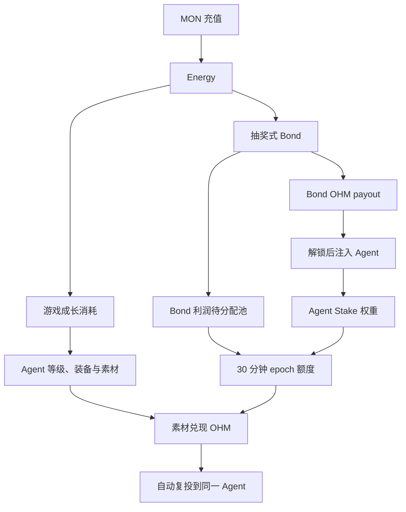
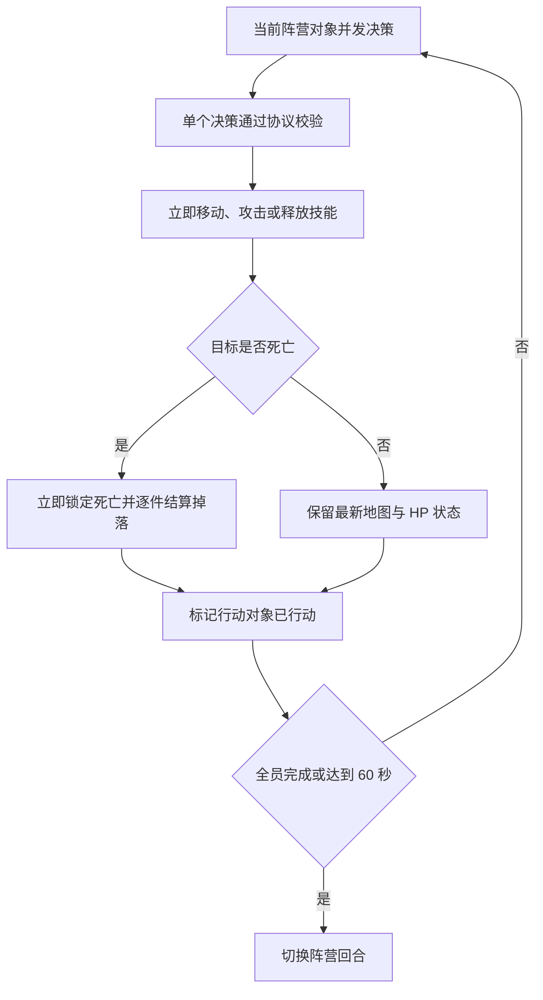

# Lumiterra 数值内核

## 文档阅读方式

本文档使用固定格式区分不同类型的信息：

| 格式 | 用途 |
|---|---|
| **规则** | 说明必须遵守的游戏逻辑 |
| **公式** | 说明可直接实现为程序或合约的计算关系 |
| **基础数值** | 列出公式使用的常量、范围和 Lv1–9 数值表 |
| **操作流程** | 说明规则在程序中的执行顺序 |
| **例子** | 只用来帮助理解，不会引入新规则 |

## 1. 数值范围

本文档定义游戏最底层的价值转换与 OHM 分配过程：

### 操作流程｜底层价值转换



本文档同时定义三职业共用的回合、伤害、Agent 成长与合成参数。以下内容仍由各自系统模块定义：

- 各等级操作对象与装备的具体属性；
- AI、Gas 和模型调用等运行 Energy；
- Bond OHM 的具体线性解锁周期；
- Marketplace 价格、P2P 借贷条款和清算执行。

## 2. 基础规则

### 2.1 Energy 本身没有等级

Energy 始终是同一种不可交易的记账资产：

```text
EnergyMinted = MONDeposited
1 Energy = 1 MON

EnergyReserveMONAfterRecharge
= EnergyReserveMONBeforeRecharge + MONDeposited
```

Energy 只有两条互斥路径：

| 路径 | 结果 |
|---|---|
| 游戏成长 | 支付生产、Agent 运行和装备成长成本；不生成 OHM mint 额度 |
| 抽奖式 Bond | 对应 MON 进入国库；产生 Bond OHM payout 与协议利润 |

同一单位 Energy 一经使用即销毁，不能同时进入两条路径。Energy 不能直接兑换为 Stake 权重；Stake 权重只读取已解锁并实际注入 Agent 的 OHM。

充值 MON 可以由同一国库合约托管，但必须保持独立账本。消耗 Energy 时才按路径归类：

```text
EnergyReserveMONAfterSpend
= EnergyReserveMONBeforeSpend - EnergySpent

GameplayRevenueMONAfter
= GameplayRevenueMONBefore + GameplayEnergySpent

BondAttributedTreasuryMONAfter
= BondAttributedTreasuryMONBefore + LotteryEnergySpent
```

只有 `BondAttributedTreasuryMON` 进入 Bond payout、利润和 1 MON 地板的背书计算。

### 2.2 只有 Bond 利润支持游戏侧 OHM 增发

```text
LotteryBondProfit
= LotteryEnergySpent - BondOHMPayout
```

游戏成长消耗的 Energy 不进入该公式。每个 Bond payout 当场铸造并锁入 depository；`LotteryBondProfit` 只登记为尚未铸造的待分配额度。游戏侧 OHM 只在合格素材实际兑现时铸造，因此：

```text
CumulativeGameOHMMinted
<= CumulativeLotteryBondProfit
```

### 2.3 Stake 权重与挖掘效率分离

- Agent 注入的 OHM 只决定该 Agent 在全局分配中的线性权重。
- Agent 等级提升移动范围、行动速度和背包容量。
- 装备提升战斗、采集或种田的职业属性。
- 等级和装备通过改变单位时间素材数量及素材等级，间接改变 OHM 兑现速度。
- 等级、装备和 Energy 消耗均不直接乘算 Stake 权重，避免形成超线性资本优势。

### 2.4 生产 Energy 由实际激活产出决定

```text
TotalProductionEnergy
= Σ(
    ActualActivatedOutputQuantity
    × SameLevelEnergyCost(ItemLevel)
  )
```

若一次行为没有获得并激活物品：

```text
TotalProductionEnergy = 0
```

生产 Energy 是游戏成本，不生成固定财富值。未激活物品以后补付 Energy 时可以按既有资格结算成长进度，但不能补挖 OHM；只有原生产结算中当场完成 Energy 激活的素材具有 OHM 挖掘资格。

### 2.5 已删除的旧经济接口

以下概念不再存在，也不能作为其他模块的隐含输入：

- 固定物品财富值；
- 财富转化率；
- Token 奖池；
- 装备回收、Slow Redeem 与 Fast Redeem；
- 合成财富守恒；
- 使用游戏成长 Energy 形成 OHM mint 额度。

P2P 装备借贷继续保留，但借贷条款由 Lender 与市场价格决定，不读取固定财富值或协议回收价。

## 3. 核心名称

| 名称 | 含义 |
|---|---|
| `AgentGrowthStage` | Agent 共享成长阶段，取值 1–9 |
| `AgentGrowthProgress` | 当前成长阶段累计获得的有效成长掉落数量 |
| `GrowthEligibleAtProduction` | 掉落是否具有 Agent 成长资格；生产时写入后不可修改 |
| `MiningEligibleAtProduction` | 素材是否在原生产结算中完成激活并具有一次性 OHM 结算资格 |
| `ActionSpeedMultiplier(Stage)` | Agent 成长阶段提供的行动速度倍率 |
| `ActiveProductionLevel` | 当前行为对应武器的装备等级，取值 1–9 |
| `ItemLevel` | 实际产出素材等级，取值 1–9 |
| `ActualActivatedOutputQuantity` | 逐件分配后归属参与对象并在原生产结算中完成激活的数量 |
| `SameLevelEnergyCost(ItemLevel)` | 激活一件该等级基础素材的基准 Energy |
| `LotteryEnergySpent` | 单次抽奖消耗的 Energy |
| `BondExpectedPayout` | 确定性 Bond 对应的期望 OHM |
| `BondOHMPayout` | 单次抽奖实际发出的 OHM |
| `LotteryBondProfit` | 本次 Bond 为游戏侧留下的未铸造 OHM 额度 |
| `GlobalPendingProfit` | 尚未进入 Agent epoch 配额的全局待分配额度 |
| `EligibleStakedOHM(Agent, Epoch)` | 本 epoch 已生效的 Agent Stake |
| `EpochOHMDistribution` | 本 epoch 从全局池释放给全部 Agent 的额度 |
| `AgentEpochQuota` | Agent 本 epoch 按 Stake 权重新增的额度 |
| `AgentUnminedQuota` | Agent 跨 epoch 累积的未挖额度 |
| `AgentQuotaAtEpochStart` | 本 epoch 素材兑现统一使用的固定基数 |
| `MaterialMiningRate(ItemLevel)` | 一件素材可兑现 epoch 起始额度的比例 |
| `MaterialOHMReward` | 一件合格素材实际挖出的 OHM |
| `PendingAutoStakeOHM` | 已挖出并等待下个 epoch 生效的自动复投 OHM |
| `ExitPrincipalOHM` | 本次请求退出的 Agent Stake 本金 |
| `ExitDurationEpochs` | 退出托管期，立即退出为 0；线性退出为 336–1,440 个 epoch |
| `ExitPenaltyRate` | 按所选退出期确定的退出罚金率 |
| `ExitPenaltyOHM` | 从退出本金中扣除、分配给合格留存 Stake 的 OHM |
| `ExitPenaltyCarryPool` | 尚未分配的已铸造退出罚金 OHM，与未铸造 Bond 利润池严格隔离 |
| `PendingExitPenaltyStakeOHM` | 获得后等待下个 epoch 自动增加 Agent Stake 的退出罚金份额 |

战棋、角色与背包字段继续在第 8–10 节定义。

## 4. 游戏成长 Energy 成本

### 4.1 同级单件 Energy

单件基础素材的激活成本每两级翻倍：

```text
SameLevelEnergyCost(ItemLevel)
= 2^((ItemLevel - 1) / 2)
```

| 等级 | Energy/件 |
|---:|---:|
| Lv1 | 1.000000 |
| Lv2 | 1.414214 |
| Lv3 | 2.000000 |
| Lv4 | 2.828427 |
| Lv5 | 4.000000 |
| Lv6 | 5.656854 |
| Lv7 | 8.000000 |
| Lv8 | 11.313708 |
| Lv9 | 16.000000 |

该成本只负责限制游戏成长吞吐，不形成 OHM 增发额度。装备和 Agent 等级通过缩短完成行为所需时间提高单位时间产出，不修改已经生成素材的单件激活成本。

### 4.2 多件结算

```text
TotalProductionEnergy
= Σ(
    ActualActivatedOutputQuantity
    × SameLevelEnergyCost(ItemLevel)
  )
```

逐件分配后因宠物容量不足而销毁、未生成、未归属或未激活的物品不扣除生产 Energy，也不能挖 OHM。

## 5. 抽奖式 Bond

### 5.1 外部输入与需求计数器

```text
TWAPWindow = 4 hours
FloorPrice = 1 MON
MaximumDiscount = 25%
DemandHalfPoint = TotalOHMSupply × 1%
DemandDecayDuration = 3 days
```

需求计数器线性衰减：

```text
DemandAtTime(t)
= DemandLast
  × max(0, 1 - (t - LastUpdateTime) / DemandDecayDuration)

DemandAfterLottery
= DemandAtTime(t) + BondOHMPayout
```

### 5.2 Bond 价格与期望 payout

```text
Discount
= MaximumDiscount
  × DemandHalfPoint
  / (DemandHalfPoint + DemandAtTime(t))

BondPrice
= max(
    TWAP × (1 - Discount),
    FloorPrice
  )

BondExpectedPayout
= LotteryEnergySpent / BondPrice

MaximumBondPayout
= LotteryEnergySpent
```

`MaximumBondPayout` 保证每个实际发出的 OHM 至少有 1 MON 国库资产对应。

### 5.3 四档概率与精确期望

基础分布使用以下配平值：

| 档位 | 原始倍数 | 概率 |
|---|---:|---:|
| 基础 | 0.80× | 66.333333% |
| 幸运 | 1.10× | 18.666667% |
| 大吉 | 1.60× | 12.000000% |
| 传说 | 2.40× | 3.000000% |

```text
Σ TierProbability = 100%
Σ(TierProbability × RawTierMultiplier) = 1.000000
```

当任一档位会撞到 `MaximumBondPayout` 时，不能只做简单截断，否则实际期望会低于确定性 Bond。协议求解最小的 `ClampBalanceScale >= 1`，使：

```text
TierPayout(Tier)
= min(
    ClampBalanceScale
    × RawTierMultiplier(Tier)
    × BondExpectedPayout,
    MaximumBondPayout
  )

Σ(
  TierProbability(Tier)
  × TierPayout(Tier)
)
= BondExpectedPayout
```

该方程是分段线性单调方程，可用固定上限二分查找求解。当地板使 `BondExpectedPayout = MaximumBondPayout` 时，四档结果全部收敛为同一个 payout，随机加成自然消失。

### 5.4 单笔限制与记账

```text
MaximumLotteryEnergyPerTransaction
= TotalOHMSupply × 0.5%

LotteryBondProfit
= LotteryEnergySpent - BondOHMPayout

EnergyReserveMONAfterBond
= EnergyReserveMONBeforeBond - LotteryEnergySpent

BondAttributedTreasuryMONAfter
= BondAttributedTreasuryMONBefore + LotteryEnergySpent

TotalOHMSupplyAfterBond
= TotalOHMSupplyBefore + BondOHMPayout

DepositoryOHMAfter
= DepositoryOHMBefore + BondOHMPayout
```

超过单笔上限的投入必须拆成多笔，并在每笔后更新需求计数器和 Bond 价格。

## 6. 全局 OHM 待分配池与 epoch 释放

### 6.1 时间参数

```text
MiningEpochDuration = 30 minutes
ProfitReleaseHalfLife = 8 hours
EpochsPerHalfLife = 16

ProfitReleaseRatePerEpoch
= 1 - 2^(-MiningEpochDuration / ProfitReleaseHalfLife)
= 1 - 2^(-1 / 16)
≈ 4.239%
```

在不受 Stake 收益率上限约束时，一笔新增利润额度累计释放：

| 经过时间 | 累计释放 |
|---:|---:|
| 30 分钟 | 4.239% |
| 8 小时 | 50.000% |
| 16 小时 | 75.000% |
| 24 小时 | 87.500% |
| 32 小时 | 93.750% |

### 6.2 单 epoch 释放

本 epoch 新产生的 Bond 利润从下一个 epoch 才进入 `GlobalPendingProfit`：

```text
PendingProfitBeforeDistribution(Epoch)
= PendingProfitAfterDistribution(Epoch - 1)
  + MaturedBondProfitFromPreviousEpoch
  + QuotaReturnedByStakeReduction

RawEpochDistribution
= PendingProfitBeforeDistribution(Epoch)
  × ProfitReleaseRatePerEpoch

MaximumEpochRewardRate = 0.01%

EpochRewardRateCap
= TotalOHMSupplyBeforeEpochDistribution
  × MaximumEpochRewardRate

EpochOHMDistribution
= TotalEligibleStakedOHM(Epoch) > 0
  ? min(RawEpochDistribution, EpochRewardRateCap)
  : 0

PendingProfitAfterDistribution
= PendingProfitBeforeDistribution
  - EpochOHMDistribution
```

`0.01% / 30 分钟` 约等于早期 OHM `0.1587% / 8 小时` 的释放量级，并同样以 OHM 总供应为 reward-rate 基数。它是上限而非承诺；Bond 利润不足时实际 reward rate 自动下降，没有生效 Stake 时则完全不释放。

### 6.3 全局安全不变量

```text
GlobalPendingProfit >= 0
EpochOHMDistribution <= GlobalPendingProfitBeforeDistribution

CumulativeGameOHMMinted
+ GlobalPendingProfit
+ Σ AgentUnminedQuota
<= CumulativeLotteryBondProfit
```

上式中的未铸造额度只能处于全局待分配池或 Agent 未挖额度之一，不能重复记账。

## 7. Agent Stake、额度与素材挖掘

### 7.1 Stake 生效

所有 Stake 变化在下一个 epoch 边界原子生效：

```text
EligibleStakedOHM(Agent, Epoch)
= EligibleStakedOHM(Agent, Epoch - 1)
  + PendingExternalStakeOHM(Agent, Epoch - 1)
  + PendingAutoStakeOHM(Agent, Epoch - 1)
  + PendingExitPenaltyStakeOHM(Agent, Epoch - 1)
  - PendingUnstakeOHM(Agent, Epoch - 1)
```

只有已解锁 OHM 可以进入 `PendingExternalStakeOHM`。在同一 epoch 内，Stake 权重、Agent 新增额度和 `AgentQuotaAtEpochStart` 均保持不变。

### 7.2 按 Stake 线性分配额度

```text
TotalEligibleStakedOHM(Epoch)
= Σ EligibleStakedOHM(Agent, Epoch)

AgentEpochQuota(Agent, Epoch)
= EpochOHMDistribution(Epoch)
  × EligibleStakedOHM(Agent, Epoch)
  / TotalEligibleStakedOHM(Epoch)

AgentQuotaAtEpochStart
= AgentUnminedQuotaBeforeEpoch
  + AgentEpochQuota
```

实现使用高精度定点数。逐 Agent 向下取整后的尾差留在 `GlobalPendingProfit`，不能分给结算调用者。

### 7.3 减少 Stake 时返还未挖额度

```text
StakeReductionRate
= PendingUnstakeOHM
  / EligibleStakedOHMBeforeUnstake

QuotaReturnedByStakeReduction
= AgentUnminedQuotaBeforeUnstake
  × StakeReductionRate

AgentUnminedQuotaAfterUnstake
= AgentUnminedQuotaBeforeUnstake
  - QuotaReturnedByStakeReduction
```

完全撤出 Stake 时，全部未挖额度退回全局待分配池。额度不是可脱离 Stake 单独持有或转让的资产。

### 7.4 Shadow 式退出税与留存者分配

每个自然日包含 `48` 个 30 分钟 epoch。线性退出允许选择 `336–1,440` 个 epoch，即 `7–30 天`。立即退出使用单独的 `0 epoch` 路径。

```text
MinimumLinearExitEpochs = 7 × 48 = 336
MaximumLinearExitEpochs = 30 × 48 = 1,440
MaximumExitPenaltyRate = 50%

ExitPenaltyRate(ExitDurationEpochs) =
  50%,                                      if ExitDurationEpochs = 0
  50% × (1,440 - ExitDurationEpochs)
      / (1,440 - 336),                      if 336 ≤ ExitDurationEpochs ≤ 1,440

ExitPenaltyOHM
= ExitPrincipalOHM × ExitPenaltyRate

ExitNetOHM
= ExitPrincipalOHM - ExitPenaltyOHM
```

| 退出方式 | 退出期 | 罚金率 | 退出 1,000 OHM 的净到账 | 留存者获得 |
|---|---:|---:|---:|---:|
| 立即退出 | 0 天 | 50.000% | 500.00 | 500.00 |
| 最短线性 | 7 天 | 50.000% | 500.00 | 500.00 |
| 线性退出 | 14 天 | 34.783% | 652.17 | 347.83 |
| 线性退出 | 21 天 | 19.565% | 804.35 | 195.65 |
| 完整退出 | 30 天 | 0.000% | 1,000.00 | 0.00 |

退出请求在下一个 epoch 边界原子生效：`ExitPrincipalOHM` 从生效 Stake 中移入不可取消的退出托管，并立即停止获得 Agent 额度、素材挖掘权与退出罚金分配；对应未挖额度按第 7.3 节退回全局池。`ExitNetOHM` 在选择的退出期结束后进入钱包可用余额。

罚金分配使用同一边界的结算快照，并排除本边界进入退出队列的 Stake。为防止临时注入抢分配，只有连续生效满 `7 天`且未排队退出的 Stake 进入分母：

```text
PenaltyEligibleStakeOHM(Agent)
= Σ StakeLotAmount,
  for each StakeLot where ContinuousStakeAgeEpochs ≥ 336
  and StakeLot is not entering the exit queue

TotalPenaltyEligibleStakeOHM
= Σ PenaltyEligibleStakeOHM(Agent)

ExitPenaltyAvailableOHM
= ExitPenaltyCarryPoolBeforeEpoch + NewExitPenaltyOHM

ExitPenaltyShareOHM(Agent)
= ExitPenaltyAvailableOHM
  × PenaltyEligibleStakeOHM(Agent)
  / TotalPenaltyEligibleStakeOHM

PendingExitPenaltyStakeOHM(Agent, NextEpoch)
= ExitPenaltyShareOHM(Agent)
```

Stake 需要按注入批次记录连续生效年龄；部分退出只排除被选中退出的批次或批次数量，玩家留在 Agent 内且满足年龄条件的其余 Stake 仍可参与分配。分配所得不会进入钱包，而是从下一个 epoch 直接增加同一 Agent 的 Stake，并继续受退出规则约束。定点数向下取整产生的尾差继续留在 `ExitPenaltyCarryPool`。若合格 Stake 分母为 0，整笔罚金继续留在 `ExitPenaltyCarryPool`，下一 epoch 再尝试分配；退出者和结算调用者均不能领取。

`ExitPenaltyCarryPool` 持有的是已经铸造的 OHM，必须与代表未铸造额度的 `GlobalPendingProfit` 严格隔离。罚金只做 OHM 本金的重新分配，不 mint、不 burn，因此不会改变 OHM 总供应。

### 7.5 素材指数兑现曲线

```text
MaterialMiningCurveBase = 1.25
MinimumMaterialMiningRate = 1%
MaximumMaterialMiningRate = 9%

MaterialMiningRate(ItemLevel)
= MinimumMaterialMiningRate
  + (MaximumMaterialMiningRate - MinimumMaterialMiningRate)
  × (
      MaterialMiningCurveBase^(ItemLevel - 1) - 1
    )
  / (
      MaterialMiningCurveBase^8 - 1
    )
```

| 素材等级 | 每件兑现比例 |
|---:|---:|
| Lv1 | 1.000% |
| Lv2 | 1.403% |
| Lv3 | 1.907% |
| Lv4 | 2.537% |
| Lv5 | 3.325% |
| Lv6 | 4.309% |
| Lv7 | 5.539% |
| Lv8 | 7.077% |
| Lv9 | 9.000% |

归一化指数曲线使后期相邻等级的绝对提升更大，同时严格固定 Lv1 与 Lv9 端点。

### 7.6 单件素材挖掘

只有同时满足以下条件的基础素材可以挖 OHM：

```text
MaterialMiningEligible
= DropWinnerIsAgent
  and MiningEligibleAtProduction
  and IsBaseMaterial
  and ItemLevel in [1, 9]
  and AgentRemainingQuota > 0
```

```text
NominalMaterialOHMReward
= AgentQuotaAtEpochStart
  × MaterialMiningRate(ItemLevel)

MaterialOHMReward
= min(
    AgentRemainingQuotaBeforeMaterial,
    NominalMaterialOHMReward
  )

AgentRemainingQuotaAfterMaterial
= AgentRemainingQuotaBeforeMaterial
  - MaterialOHMReward

PendingAutoStakeOHMAfterMaterial
= PendingAutoStakeOHMBeforeMaterial
  + MaterialOHMReward
```

同一 epoch 的所有素材始终读取固定的 `AgentQuotaAtEpochStart`，而不是读取不断下降的剩余额度。累计兑现达到 100% 时停止发放；同一素材 ID 只能结算一次。

每件当场激活素材都必须写入一次 `MiningSettlementRecorded`，即使当时剩余额度为 0、实际奖励为 0，也不能把该素材保存到未来 epoch 再次尝试挖 OHM。

### 7.7 典型成长效率

使用第 10 节的典型有效素材间隔，并令 Lv9 参考间隔为 5 分钟：

| 等级 | 典型素材间隔 | 每件比例 | 30 分钟典型兑现比例 |
|---:|---:|---:|---:|
| Lv1 | 1.0 分钟 | 1.000% | 30.00% |
| Lv2 | 1.4 分钟 | 1.403% | 30.07% |
| Lv3 | 1.8 分钟 | 1.907% | 31.79% |
| Lv4 | 2.2 分钟 | 2.537% | 34.60% |
| Lv5 | 2.7 分钟 | 3.325% | 36.94% |
| Lv6 | 3.3 分钟 | 4.309% | 39.17% |
| Lv7 | 4.2 分钟 | 5.539% | 39.57% |
| Lv8 | 5.0 分钟 | 7.077% | 42.46% |
| Lv9 | 5.0 分钟 | 9.000% | 54.00% |

该表是典型条件下的校准基准，不是硬编码产量。Agent 等级带来的行动速度、移动范围，以及装备职业数值都会改变实际素材间隔；实际兑现始终以上链产出和剩余额度为准。

### 7.8 结算顺序

```text
1. 应用上一 epoch 排队的外部 Stake、素材自动复投与退出罚金自动复投
2. 将本边界生效的退出本金移入退出托管，并把对应未挖额度退回全局池
3. 合并新退出罚金与 `ExitPenaltyCarryPool`，以排除退出队列后的有效 Stake 快照分配；份额写入下一 epoch 的 `PendingExitPenaltyStakeOHM`，未分配余额继续结转
4. 将到期退出托管中的净 OHM 转入用户钱包
5. 将上一 epoch Bond 利润加入全局池
6. 按 8 小时半衰期与 reward-rate 上限计算本 epoch 总分配
7. 按生效 Stake 比例写入各 Agent 新额度
8. 锁定各 Agent 的 AgentQuotaAtEpochStart
9. epoch 内由合格素材逐件兑现
10. 挖出的 OHM 进入 `PendingAutoStakeOHM`，等待下一 epoch
```

### 7.9 完整结算例子

假设 epoch 开始前：

```text
TotalOHMSupply = 100,000 OHM
TotalEligibleStakedOHM = 20,000 OHM
GlobalPendingProfit = 1,000 OHM 额度

AgentAEligibleStakedOHM = 2,000 OHM
AgentAUnminedQuotaBeforeEpoch = 4 OHM
```

全局释放：

```text
RawEpochDistribution
= 1,000 × 4.239%
= 42.397 OHM

EpochRewardRateCap
= 100,000 × 0.01%
= 10 OHM

EpochOHMDistribution
= min(42.397, 10)
= 10 OHM
```

Agent A 占全局生效 Stake 的 `10%`：

```text
AgentAEpochQuota = 10 × 10% = 1 OHM
AgentAQuotaAtEpochStart = 4 + 1 = 5 OHM
```

若 Agent A 在本 epoch 当场激活 3 件 Lv5 素材：

```text
OHMPerLv5Material = 5 × 3.325% = 0.16625 OHM
TotalMinedOHM = 3 × 0.16625 = 0.49875 OHM
AgentARemainingQuota = 5 - 0.49875 = 4.50125 OHM
PendingAutoStakeOHM = 0.49875 OHM
```

`0.49875 OHM` 在下一 epoch 自动加入 Agent A 的 Stake；剩余 `4.50125 OHM` 继续结转。

## 8. 统一战棋遭遇与伤害

战斗、采集和种田共用同一套有限地图、阵营回合、移动、技能、HP、伤害与逐件掉落公式。类型只决定读取哪组职业属性、武器、敌方配置和掉落表。

### 8.1 属性与武器映射

| 当前行为 | 攻击 | 防御 | 暴击率 | 武器 | 敌方对象 |
|---|---|---|---|---|---|
| 战斗 | `CombatAttack` | `CombatDefense` | `CombatCriticalChance` | 剑 | 怪物 |
| 采集 | `GatherAttack` | `GatherDefense` | `GatherCriticalChance` | 斧头 | 采集物 |
| 种田 | `FarmAttack` | `FarmDefense` | `FarmCriticalChance` | 水壶 | 作物或农田对象 |

角色和敌方对象都使用相同的 HP、攻击、防御、暴击率和技能字段。`Health` 在三种遭遇之间共享，不能通过切换类型恢复。

### 8.2 地图、移动与回合参数

```text
FriendlyFirstChance = 50%
EnemyFirstChance = 50%
FactionTurnMaximumDuration = 60 seconds
EncounterMaximumDuration = 30 minutes

MapWidth = EncounterConfig.MapWidth
MapHeight = EncounterConfig.MapHeight

CanMoveToGrid
= HorizontalDistance² + VerticalDistance²
  <= UnitMoveRange²
```

- 遭遇地图长宽有限，但同一格允许任意数量的友方或敌方对象堆叠。
- 遭遇开始时使用协议随机数决定先手阵营，一个完整轮次由友方和敌方各一个阵营回合组成。
- 同阵营对象并发决策；每个有效决策按协议确认顺序立即执行，不等待阵营回合结束。
- 当前阵营所有对象完成行动，或阵营回合达到 60 秒时切换阵营；超时未行动对象自动待机。
- 新加入对象生成在友方地图边界，从下一个友方回合开始获得行动机会。

### 8.3 技能与伤害公式

#### 基础数值｜技能与伤害常量

```text
DefenseScale = 100
MinimumDamage = 1
NormalSkillCoefficient = 100%
NormalDamageMultiplier = 100%
MinimumCriticalMultiplier = 100%
MaximumCriticalMultiplier = 200%
MaximumCriticalChance = 50%
FriendlyFireEnabled = false
```

每个技能配置：

```text
CastRange
SkillCoefficient
EffectRadius
IsGridAOE
```

`CastRange` 限制施法者与目标对象或目标格的距离；`EffectRadius` 限制目标格周围的效果范围。单体技能选择具体对象，格子 AOE 对范围内全部敌方对象分别执行一次伤害公式，永远不伤害友方。

```text
CanCastAtGrid
= CastHorizontalDistance² + CastVerticalDistance²
  <= CastRange²

IsInsideEffectRadius
= EffectHorizontalDistance² + EffectVerticalDistance²
  <= EffectRadius²
```

#### 公式｜单个目标伤害

```text
EffectiveCriticalChance
= clamp(AttackerCriticalChance, 0%, MaximumCriticalChance)

EffectiveSkillAttack
= floor(AttackerAttack × SkillCoefficient)

BaseDamage
= max(
    MinimumDamage,
    floor(
      EffectiveSkillAttack × DefenseScale
      ÷ (DefenseScale + DefenderDefense)
    )
  )

IsCritical
= RandomBasisPoints(ActionSeed, ActionId, DefenderId, "critical-hit")
  < EffectiveCriticalChance

MinimumCriticalDamage
= floor(BaseDamage × MinimumCriticalMultiplier)

MaximumCriticalDamage
= floor(BaseDamage × MaximumCriticalMultiplier)

FinalDamage
= IsCritical
  ? RandomInteger(
      ActionSeed,
      ActionId,
      DefenderId,
      "critical-damage",
      MinimumCriticalDamage,
      MaximumCriticalDamage
    )
  : floor(BaseDamage × NormalDamageMultiplier)

DefenderHealthAfterHit
= max(0, DefenderHealthBeforeHit - FinalDamage)
```

普通攻击使用 `NormalSkillCoefficient = 100%`。`ActionSeed` 必须来自协议认可的随机数来源；AOE 对不同目标使用 `DefenderId` 隔离随机结果。所有属性和伤害使用非负整数，百分比在程序中使用基点表示。

<details>
<summary>期望伤害与示例</summary>

暴击倍率在 100%–200% 均匀分布时，平均暴击倍率为 150%：

```text
ExpectedDamagePerHit
= BaseDamage
  × [1 + EffectiveCriticalChance × (150% - 100%)]

ExpectedActionsToDefeat
= ceil(TargetHealth ÷ ExpectedDamagePerHit)
```

攻击 150、防御 50、技能系数 100%、暴击率 20% 时，普通伤害为 100，暴击伤害范围为 100–200，期望单次伤害为 110。

</details>

### 8.4 行动状态与即时执行



- 每个对象每个阵营回合只有一次正式行动；可以先移动，再攻击、释放技能、待机或撤离。
- 正式行动确认前可以不限次数更换实际携带的装备和使用血瓶，这些准备操作不消耗移动或正式行动。
- 已选目标在行动确认前死亡时，校验失败且对象不记为已行动，可以在剩余时间内重新决策。
- 友方对象只有位于地图边界时才能撤离；敌方对象不能撤离。

### 8.5 多人有效伤害与逐件掉落

每个敌方对象独立累计伤害，最后一击的溢出伤害不增加掉落权重：

```text
ValidDamage(Participant, Target, Hit)
= min(FinalDamage, TargetHealthBeforeHit)

ParticipantValidDamage(Participant, Target)
= Σ ValidDamage(Participant, Target, Hit)

DamageShare(Participant, Target)
= ParticipantValidDamage(Participant, Target)
  ÷ Σ AllParticipantsValidDamage(Target)

NormalDropEligible(Participant, Target)
= ParticipantValidDamage(Participant, Target) > 0

RareDropMinimumDamageShare = 5%

RareDropEligible(Participant, Target)
= DamageShare(Participant, Target)
  >= RareDropMinimumDamageShare

DropWinner(Target, DropEntry, ItemUnitIndex)
= RandomWeightedChoice(
    ActionSeed,
    TargetId,
    DropEntry,
    ItemUnitIndex,
    "drop-owner",
    EligibleParticipantValidDamage
  )
```

- 对象死亡后先生成掉落表结果，再把每个掉落数量拆成单件物品；每一件分别执行一次 `DropWinner`。
- 普通掉落读取 `NormalDropEligible`，稀有掉落读取 `RareDropEligible`，两者都以该对象的有效伤害作为随机权重。
- 已死亡或撤离的参与对象保留对该目标的有效伤害与掉落资格。
- 同一人类账户的宠物和唯一 Agent 各自参与计算，不合并伤害或随机权重；账户总期望概率仍等于这两个参与对象伤害占比之和。
- 随机结果使用协议随机数来源并按目标、掉落项和物品序号隔离，客户端不能指定结果。

<details>
<summary>掉落接收与背包容量</summary>

```text
AgentPendingEncounterLoot
= WinnerIsAgent
  and (WinnerExitedEncounter or CanReceiveItems = false)

PetDropDestroyed
= WinnerIsPet
  and IncomingItemWeight > PetBackpackRemainingCapacity
```

- Agent 已死亡、撤离或背包容量不足时，归属不变，物品留在遭遇地点的待领取战利品中；该 Agent 返回且容量足够后领取。
- 宠物背包容量固定为 2。宠物容量足够时物品直接进入宠物背包；容量不足时该件物品消失，不重新抽取，并在界面提示容量风险。
- 宠物获得的物品不为任何 Agent 增加成长进度；只有 Agent 自己抽中且满足资格的掉落进入该 Agent 成长计算。

</details>

### 8.6 完成时间与产量

`ExpectedActionsToDefeat` 见第 8.3 节。实际每小时素材产量和 OHM 额度兑现速度必须通过地图大小、移动范围、行动速度、双方技能、阵营回合、参与人数、决策时间、目标数量、刷新和逐件掉落共同模拟，再代入第 7.5–7.6 节公式。

### 8.7 死亡、撤离与超时

- 友方对象 HP 归零时立即退出遭遇，但保留已有有效伤害与掉落资格。
- 位于地图边界的友方对象可以用正式行动撤离；撤离后不能重新加入同一遭遇，但保留已有有效伤害与掉落资格。
- 敌方对象 HP 归零时立即锁定死亡并结算其掉落，不等待其他敌方对象。
- 到达 30 分钟上限时完成当前执行中的行动，不再接受新行动；已死亡对象的掉落保留，存活敌方对象不掉落并恢复初始状态。
- 行为过程中已经发生的 Gas、模型调用和 Agent 运行 Energy 不因死亡、撤离或超时退还。

## 9. 职业属性与装备接口

装备可以自由混搭，不要求完整职业套装。Agent 可以穿戴任意等级的装备和工具，成长阶段不参与穿戴验证。

成长阶段决定 Agent 的基础 HP、移动范围、行动速度和背包容量。装备提供各职业的攻击、防御和暴击率，但不能提供 HP，也不直接修改 Stake 权重或素材兑现比例。

### 公式｜最终属性

```text
FinalAttribute(Profession)
= FixedBaseAttribute(Profession)
+ Σ EquippedItemAttribute(Profession)
```

### 规则｜三职业属性

| 职业 | 最终属性 |
|---|---|
| 战斗 | `CombatAttack`、`CombatDefense`、`CombatCriticalChance` |
| 采集 | `GatherAttack`、`GatherDefense`、`GatherCriticalChance` |
| 种田 | `FarmAttack`、`FarmDefense`、`FarmCriticalChance` |

`Health` 为共享属性：

```text
MaximumHealth
= FixedBaseHealth
  × HealthMultiplier(AgentGrowthStage)

FinalMoveRange
= MoveRange(AgentGrowthStage)

FinalActionSpeedMultiplier
= ActionSpeedMultiplier(AgentGrowthStage)

FinalBackpackCapacity
= BackpackCapacity(AgentGrowthStage)
```

成长阶段在生产结算完成后更新；阶段提升时重新计算 `MaximumHealth`，但当前 `Health` 保持不变，因此阶段提升不会产生免费治疗。

```text
HealthMultiplier(AgentGrowthStage)
= 1 + 0.5 × (AgentGrowthStage - 1)

MoveRange(AgentGrowthStage)
= 4 + AgentGrowthStage

ActionSpeedMultiplier(AgentGrowthStage)
= 1 + 0.1 × (AgentGrowthStage - 1)

EffectiveActionInterval
= ConfiguredBaseActionInterval
  ÷ ActionSpeedMultiplier(AgentGrowthStage)

BackpackCapacity(AgentGrowthStage)
= round(
    10 × 100^((AgentGrowthStage - 1) / 8)
  )
```

### 基础数值｜Agent 成长属性

| 成长阶段 | 基础 HP 倍率 | 移动范围 | 行动速度 | 背包容量 |
|---:|---:|---:|---:|---:|
| Lv1 | 1.0× | 5 格 | 1.0× | 10 |
| Lv2 | 1.5× | 6 格 | 1.1× | 18 |
| Lv3 | 2.0× | 7 格 | 1.2× | 32 |
| Lv4 | 2.5× | 8 格 | 1.3× | 56 |
| Lv5 | 3.0× | 9 格 | 1.4× | 100 |
| Lv6 | 3.5× | 10 格 | 1.5× | 178 |
| Lv7 | 4.0× | 11 格 | 1.6× | 316 |
| Lv8 | 4.5× | 12 格 | 1.7× | 562 |
| Lv9 | 5.0× | 13 格 | 1.8× | 1,000 |

背包容量使用指数曲线，是因为 10–1,000 的跨度达到 100 倍；若使用线性曲线，前期会一次增加约 124 容量，削弱早期容量管理。行动速度按等级线性增长，只缩短可配置的行为间隔；在阵营回合内仍遵守每对象一次正式行动的上限。护甲、工具和武器只在对应职业行为中提供职业属性。

### 公式｜背包容量

```text
DefaultItemWeight = 1

BackpackUsedCapacity
= Σ(ItemQuantity(Item) × ItemWeight(Item))

BackpackRemainingCapacity
= FinalBackpackCapacity - BackpackUsedCapacity

IncomingItemWeight
= Σ(IncomingItemQuantity(Item) × ItemWeight(Item))

CanReceiveItems
= IncomingItemWeight <= BackpackRemainingCapacity
```

所有物品的 `ItemWeight` 默认均为 1，因此默认情况下背包容量等于可携带物品总数量。若后续单独配置其他重量，仍使用同一容量公式。已穿戴并存放在装备栏的物品不计入 `BackpackUsedCapacity`。

移动范围、行动速度和背包容量不进入单件物品的 Energy 或 OHM 公式，但会通过减少移动回合、行为间隔、回城和清包频率间接提高每小时素材产出和 OHM 额度兑现速度，必须计入战棋地图模拟与三职业平衡测试。

### 9.1 操作对象属性

怪物、资源对象和作物统一配置以下字段：

```text
TargetHealth
TargetAttack
TargetDefense
TargetCriticalChance
TargetLevel
DropTable
MoveRange
SkillSet
WorldDisplayQuantity
```

`WorldDisplayQuantity` 等于进入遭遇后生成的敌方对象数量。怪物可以配置移动范围和技能；采集物与作物的 `MoveRange` 默认为 0，但仍可配置攻击技能。`TargetLevel` 用于选择目标属性和掉落表，不直接进入伤害、Energy 或 Agent 成长公式。实际产出的 `ItemLevel` 决定物品的 Energy、素材挖 OHM 比例和有效成长掉落资格。

### 9.2 宠物属性

```text
PetInheritanceRate = 33%
PetBackpackCapacity = 2
PetMinimumMoveRange = 5
PetMinimumCriticalChance = 0
StarterEquipmentLevel = 1
StarterEquipmentTradable = false
StarterEquipmentLoanEligible = false

PetFinalAttribute
= SourceAgentExists
  ? max(
      PetMinimumFinalAttribute,
      floor(SourceAgentFinalAttribute × PetInheritanceRate)
    )
  : PetMinimumFinalAttribute

PetMoveRange
= SourceAgentExists
  ? max(PetMinimumMoveRange, SourceAgentMoveRange)
  : PetMinimumMoveRange

PetBackpackUsedCapacity
= Σ((ActivatedPetItemQuantity(Item) + UnactivatedPetItemQuantity(Item))
  × ItemWeight(Item))

PetBackpackRemainingCapacity
= PetBackpackCapacity - PetBackpackUsedCapacity
```

`PetFinalAttribute` 用于最大 HP 以及战斗、采集、种田的攻击、防御和暴击率。最低值不依赖 Agent；拥有 Agent 后，只有 33% 继承值高于最低值的属性才会实际提高。移动范围不使用 33% 比例，直接取 5 与来源 Agent 移动范围中的较高值。

<details>
<summary>宠物最低属性校准</summary>

宠物最低值与初始装备需要满足普通 Lv1 对象的无暴击基准测试：

```text
PetMinimumNormalDamage(Profession)
= max(
    1,
    PetMinimumAttack(Profession)
    - StandardLevel1TargetDefense(Profession)
  )

PetMinimumActionsToComplete(Profession)
= ceil(
    StandardLevel1TargetHealth(Profession)
    ÷ PetMinimumNormalDamage(Profession)
  )

PetMinimumActionsToComplete(Profession) <= 10

PetMinimumMaximumHealth
> (PetMinimumActionsToComplete(Profession) - 1)
  × max(
      1,
      StandardLevel1TargetAttack(Profession)
      - PetMinimumDefense(Profession)
    )
```

该测试只覆盖普通 Lv1 对象，不要求宠物最低属性能够完成精英、Boss 或其他高难度对象。具体最低属性在 Lv1 对象属性确定后反推。

</details>

宠物首次创建时获得以下绑定初始装备：

- Lv1 剑；
- Lv1 斧头；
- Lv1 水壶。

初始装备不能交易、借贷或作为装备升级材料。初始装备只提供对应行为的 Lv1 有效生产等级，存放在装备栏，不占用宠物背包容量。

宠物进入遭遇时读取并锁定所属账户的唯一 Agent 作为属性来源，遭遇过程中不因该 Agent 换装或成长而重算。

账户没有 Agent 时直接锁定宠物最低属性。宠物始终不继承 Agent 的背包容量，其普通背包容量固定为 2；已激活与未激活物品共同占用该容量，初始装备不占用容量。

### 9.3 无 Agent 宠物的产出与 Gas

```text
NoAgentEnergyTopUpEnabled = true
NoAgentLotteryBondEnabled = true
NoAgentProductionActivationEnabled = false
NoAgentOutputActivatedByDefault = false
NoAgentOutputGrowthEligible = false
PetOutputGrowthEligible = false
PetOutputMiningEligible = false
StarterGasSubsidy = 0
```

- 账户没有 Agent 时仍可充值 Energy 并参与抽奖式 Bond，但宠物产出默认进入未激活背包，不能在无 Agent 状态下使用生产 Energy 激活。
- 宠物手动操作产生的链上 Gas 由玩家钱包直接支付，协议不补贴 Gas。
- 购买 Agent 后可以支付生产 Energy 激活历史未激活物品，但历史物品不能补挖 OHM。
- 宠物获得的物品始终不为任何 Agent 增加成长进度；`GrowthEligibleAtProduction` 对宠物产出固定为 `false`。
- 购买 Agent 前的产出在之后激活也不补发成长进度。

### 9.4 主城共享仓库

```text
WarehouseCapacity = Unlimited
WarehouseOwner = HumanAccount
WarehouseSharedBy = Pet + AllAgentsOwnedBy(HumanAccount)

WarehouseBalanceAfterDeposit(Item)
= WarehouseBalanceBefore(Item) + DepositQuantity(Item)

WarehouseBalanceAfterWithdraw(Item)
= WarehouseBalanceBefore(Item) - WithdrawQuantity(Item)
```

取出时必须满足：

```text
WarehouseBalanceBefore(Item) >= WithdrawQuantity(Item)

Σ(WithdrawQuantity(Item) × ItemWeight(Item))
<= BackpackRemainingCapacity
```

- 仓库容量无限，不使用背包容量成长曲线。
- 宠物与同一人类账户下的唯一 Agent 读取同一份仓库余额；Agent 不单独拥有仓库。
- 存取操作只允许在主城仓库交互距离内执行，并按物品原子增减余额。
- 仓库中的物品不能直接用于生产、合成或穿戴；必须先取出到执行角色背包。
- 未激活产出不能存入仓库；只有激活后的普通物品可以存入。

同成长阶段、相近装备水平和最佳连续运行条件下，战斗、采集和种田的长期期望素材产出及 OHM 额度兑现速度差距应控制在 10% 以内。

## 10. 有效成长掉落与 Agent 成长

每个 Agent 只保存一条 Lv1–9 成长阶段与有效成长掉落进度，不建立战斗、采集或种田职业等级与职业进度。三种玩法产生的合格掉落直接累加到同一条进度；当前阶段累计获得 2,000 件有效成长掉落后进入下一阶段。

### 基础数值｜升级与反馈目标

```text
EffectiveGrowthDropsRequiredPerStage = 2,000
GrowthStageTransitions = 8
TargetAgentActiveHoursToMax = 720 hours
MinimumAverageEffectiveDropInterval = 1 minute
MaximumAverageEffectiveDropInterval = 5 minutes
```

### 公式｜有效成长掉落

```text
EffectiveGrowthDropIncrement
= Σ ActualActivatedBaseDropQuantity
  where ItemLevel = AgentGrowthStage
  and DropWinner = Agent
  and GrowthEligibleAtProduction = true

EffectiveGrowthDropProgressAfterSettlement
= min(
    EffectiveGrowthDropsRequiredPerStage,
    EffectiveGrowthDropProgressBeforeSettlement
    + EffectiveGrowthDropIncrement
  )

GrowthStageAdvance
= EffectiveGrowthDropProgressAfterSettlement
  >= EffectiveGrowthDropsRequiredPerStage
```

- 只有掉落实际随机给该 Agent、支付生产 Energy 并完成激活，且物品等级等于当前成长阶段、分配时已标记成长资格的基础掉落计入。
- `GrowthEligibleAtProduction` 在逐件分配时根据获胜对象是否为 Agent 写入；宠物产出固定为 `false`，之后购买 Agent、转移或激活物品都不能改变该标记。
- 掉落所属职业、当前玩法和历史职业产出占比不参与成长判定，也不分别保存进度。
- 稀有掉落、额外奖励、购买、转入、合成和系统赠送不计入。
- 多人结算只读取最终实际分配给该 Agent 的物品数量；同账户其他 Agent 和宠物的物品不计入。
- 物品在计入后可以交易、合成或消耗，不扣减已有进度。
- 进入下一成长阶段后进度归零，超过 2,000 件的部分不结转。
- 未分配掉落、因宠物容量不足销毁的物品、超时存活对象和未激活物品不增加 Agent 成长进度；Agent 死亡或撤离本身不取消其之后抽中的合格掉落进度。

### 公式｜成长时间

```text
ExpectedHoursForGrowthStage(CurrentStage)
= EffectiveGrowthDropsRequiredPerStage
  × TargetAverageEffectiveDropInterval(CurrentStage)
  ÷ 60 minutes

ExpectedHoursFromGrowthStage1To9
= Σ ExpectedHoursForGrowthStage(Stage), Stage = 1…8
= 720 hours
```

### 基础数值｜各成长阶段时间

| 成长阶段 | 所需掉落 | 平均每件间隔 | 本阶段有效生产时间 | 累计有效生产时间 |
|---|---:|---:|---:|---:|
| Lv1 → Lv2 | 2,000 件 Lv1 | 1.0 分钟 | 33.33 小时 | 33.33 小时 |
| Lv2 → Lv3 | 2,000 件 Lv2 | 1.4 分钟 | 46.67 小时 | 80.00 小时 |
| Lv3 → Lv4 | 2,000 件 Lv3 | 1.8 分钟 | 60.00 小时 | 140.00 小时 |
| Lv4 → Lv5 | 2,000 件 Lv4 | 2.2 分钟 | 73.33 小时 | 213.33 小时 |
| Lv5 → Lv6 | 2,000 件 Lv5 | 2.7 分钟 | 90.00 小时 | 303.33 小时 |
| Lv6 → Lv7 | 2,000 件 Lv6 | 3.3 分钟 | 110.00 小时 | 413.33 小时 |
| Lv7 → Lv8 | 2,000 件 Lv7 | 4.2 分钟 | 140.00 小时 | 553.33 小时 |
| Lv8 → Lv9 | 2,000 件 Lv8 | 5.0 分钟 | 166.67 小时 | 720.00 小时 |

八个阶段合计需要 16,000 件有效成长掉落。玩家每天投入 12 小时有效生产时间时，Agent 的目标满成长周期为 60 天。三种玩法通过对象 HP、防御、行动间隔、移动、刷新和基础掉落数量，将当前成长阶段的典型生产条件下平均获取间隔控制在目标附近；同成长阶段、典型装备条件下的有效成长掉落速度差距应控制在 10% 以内，避免玩家只使用最快玩法推进成长。种田没有成长或成熟等待状态，随机稀有掉落不用于控制成长时间。

由于装备没有成长阶段门槛，提前取得高等级装备的 Agent 可以更快完成低阶段目标。720 小时是使用当前阶段典型装备与正常路线时的平衡基准，不是协议保证的最短时间；测试必须同时覆盖提前穿戴高等级装备的成长加速比例。

## 11. 已确认初始参数

### 11.1 Agent 性格

```text
RiskPreference = 0–100
GoalFocus = 0–100
ExplorationTendency = 0–100
CooperationTendency = 0–100
ResourceCaution = 0–100
```

五项参数只影响 Agent 的决策权重和 Prompt，不进入角色属性、伤害、掉落或其他链上数值公式。

### 11.2 合成

```text
CraftSuccessRate = 100%
RecipeMode = Fixed
AdditionalCraftEnergyCost = 0
EssenceOutputQuantity = 1
EquipmentOutputQuantity = 1
BaseMaterialQuantityPerType = 1
CrossProfessionEssenceQuantity = 1
```

V1 不计算随机合成失败，也不在执行合成时额外扣除 Energy。合成销毁输入并生成输出，不记录固定财富值，不生成 OHM，也不改变任何 Agent 的未挖额度。

#### 规则｜职业依赖

| 目标职业 | 精华输入 | 装备输入 |
|---|---|---|
| 战斗 | 同等级三种不同战斗素材 | 同等级采集精华 + 种田精华 |
| 采集 | 同等级三种不同采集素材 | 同等级战斗精华 + 种田精华 |
| 种田 | 同等级三种不同种田素材 | 同等级战斗精华 + 采集精华 |

以下公式使用：

- `TargetProfession`：目标职业。
- `ItemLevel`：目标精华或装备等级。
- `EquipmentSlot`：武器、护甲或工具等目标槽位。
- `OtherProfessionA`、`OtherProfessionB`：除目标职业外的两个职业。

#### 公式｜三种基础素材合成精华

```text
Essence(TargetProfession, ItemLevel)
= Craft(
    1 × BaseMaterial(TargetProfession, ItemLevel, Type1)
    + 1 × BaseMaterial(TargetProfession, ItemLevel, Type2)
    + 1 × BaseMaterial(TargetProfession, ItemLevel, Type3)
  )

Output
= 1 × Essence(TargetProfession, ItemLevel)
```

三个 `BaseMaterial` 必须是不同素材类型，但职业和等级必须完全相同。素材此前是否挖过 OHM 不影响合成资格；合成也不会再次触发 OHM 结算。

#### 公式｜另外两职业精华合成本职业装备

Lv1 不需要旧装备：

```text
Equipment(TargetProfession, 1, EquipmentSlot)
= Craft(
    1 × Essence(OtherProfessionA, 1)
    + 1 × Essence(OtherProfessionB, 1)
  )
```

Lv2 及以上还需要同职业、同槽位的上一等级装备：

```text
Equipment(TargetProfession, ItemLevel, EquipmentSlot)
= Craft(
    1 × Equipment(TargetProfession, ItemLevel - 1, EquipmentSlot)
    + 1 × Essence(OtherProfessionA, ItemLevel)
    + 1 × Essence(OtherProfessionB, ItemLevel)
  )

where ItemLevel >= 2
```

#### 公式｜配方所含游戏 Energy 成本

以下只计算取得基础素材时已经发生的生产 Energy，不表示合成时再次收费：

```text
SameLevelEssenceAcquisitionCostEnergy(ItemLevel)
= 3 × SameLevelEnergyCost(ItemLevel)

CrossProfessionEssenceInputCostEnergy(ItemLevel)
= 2 × SameLevelEssenceAcquisitionCostEnergy(ItemLevel)
= 6 × SameLevelEnergyCost(ItemLevel)
```

| 装备等级 | 两份精华包含的基础素材 Energy |
|---:|---:|
| Lv1 | 6.000 |
| Lv2 | 8.485 |
| Lv3 | 12.000 |
| Lv4 | 16.971 |
| Lv5 | 24.000 |
| Lv6 | 33.941 |
| Lv7 | 48.000 |
| Lv8 | 67.882 |
| Lv9 | 96.000 |

装备升级吸引力不再用固定财富值或协议回收价计算。测试应比较装备带来的职业属性提升，是否能通过更短完成时间、更高等级素材和更高 OHM 额度兑现速度覆盖其市场成本。

### 11.3 P2P 装备借贷

```text
AccruedInterest
= Principal
  × APR
  × ElapsedLoanSeconds
  / SecondsPerYear

RepaymentAmount
= Principal + AccruedInterest

ProtocolInterestFee
= ActuallyPaidInterest × ConfiguredLoanFeeRate
```

- Principal、最高 LTV、APR 和期限由 Lender 设置，成交后不能单方面修改。
- 协议不提供固定装备估值或回收底价；LTV 展示使用双方认可的 Marketplace 参考价或外部价格接口。
- 一件装备同时只能担保一笔贷款。成交后进入托管，借款人可继续使用，但不能交易、转移或再次抵押。
- 提前还款只计算实际经过时间的利息，不收额外提前还款费用。
- 宽限期结束后可以清算，抵押装备归 Lender；协议只对实际支付的利息收费。
