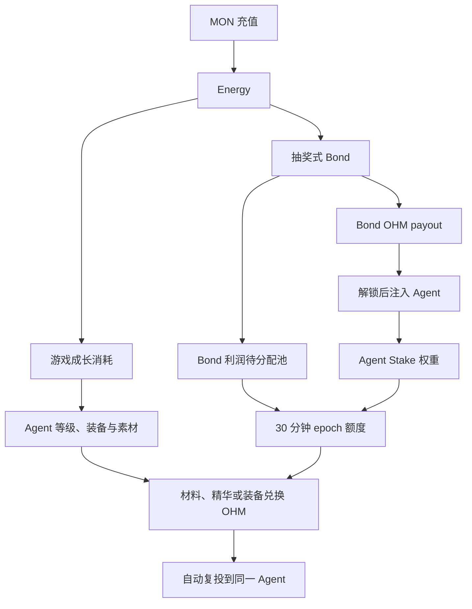
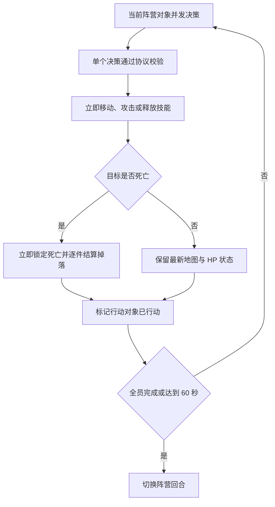

# Lumiterra 数值内核

## 文档阅读方式

本文档使用固定格式区分不同类型的信息：

| 格式 | 用途 |
|---|---|
| **规则** | 说明必须遵守的游戏逻辑 |
| **公式** | 说明可直接实现为程序或合约的计算关系 |
| **基础数值** | 列出公式使用的常量、范围和 Lv1–9 数值表 |
| **操作流程** | 说明规则在程序中的执行顺序 |
| **例子** | 只用来帮助理解，不会引入新规则 |

## 1. 数值范围

本文档定义游戏最底层的价值转换与 OHM 分配过程：

### 操作流程｜底层价值转换



本文档同时定义三职业共用的回合、伤害、Agent 成长与合成参数。以下内容仍由各自系统模块定义：

- 各等级操作对象与装备的具体属性；
- AI、Gas 和模型调用等运行 Energy；
- Bond OHM 的具体线性解锁周期；
- Marketplace 价格、P2P 借贷条款和清算执行。

## 2. 基础规则

### 2.1 Energy 本身没有等级

Energy 始终是同一种不可交易的记账资产：

```text
# 参数：
# MONDeposited = 本次充值的 MON
# EnergyMinted = 充值后铸造的 Energy
# EnergyReserveMONBefore/AfterRecharge = 充值前/后的 MON 储备余额。
EnergyMinted = MONDeposited
1 Energy = 1 MON

EnergyReserveMONAfterRecharge
= EnergyReserveMONBeforeRecharge + MONDeposited
```

Energy 只有两条互斥路径：

| 路径 | 结果 |
|---|---|
| 游戏成长 | 支付生产、Agent 运行和装备成长成本 |
| 抽奖式 Bond | 对应 MON 进入国库；产生 Bond OHM payout 与协议利润 |

同一单位 Energy 一经使用即销毁，不能同时进入两条路径。Energy 不能直接兑换为 Stake 权重；Stake 权重只读取已解锁并实际注入 Agent 的 OHM。

充值 MON 可以由同一国库合约托管，但必须保持独立账本。消耗 Energy 时才按路径归类：

```text
# 参数：
# EnergySpent = 本次消耗的 Energy
# GameplayEnergySpent = 游戏路径消耗
# LotteryEnergySpent = 抽奖 Bond 路径消耗
# 三个 Before/After 字段分别表示操作前后账本余额。
EnergyReserveMONAfterSpend
= EnergyReserveMONBeforeSpend - EnergySpent

GameplayRevenueMONAfter
= GameplayRevenueMONBefore + GameplayEnergySpent

BondAttributedTreasuryMONAfter
= BondAttributedTreasuryMONBefore + LotteryEnergySpent
```

Bond payout、协议利润和 1 MON 地板的背书计算读取 `BondAttributedTreasuryMON`。

### 2.2 Bond 利润与游戏侧 OHM 增发

```text
# 参数：
# LotteryEnergySpent = 本次抽奖投入的 Energy
# BondOHMPayout = 该次抽奖实际发放的 OHM
# LotteryBondProfit = 两者差额形成的未铸造游戏额度。
LotteryBondProfit
= LotteryEnergySpent - BondOHMPayout
```

每个 Bond payout 当场铸造并锁入 depository；`LotteryBondProfit` 登记为尚未铸造的待分配额度。游戏侧 Bond 来源 OHM 在物品实际兑换时铸造，因此：

```text
# 参数：
# CumulativeGameOHMMinted = 历史游戏兑换累计铸造 OHM
# CumulativeLotteryBondProfit = 历史 Bond 累计贡献的可铸造利润额度。
CumulativeGameOHMMinted
<= CumulativeLotteryBondProfit
```

### 2.3 Stake 权重与兑换效率分离

- Agent 注入的 OHM 只决定该 Agent 在全局分配中的线性权重。
- Agent 等级提升遭遇战棋移动范围、行动速度和背包容量。
- 装备提升战斗、采集或种田的职业属性。
- 等级和装备通过改变单位时间素材数量及素材等级，间接改变 OHM 兑现速度。
- 等级、装备和 Energy 消耗均不直接乘算 Stake 权重，避免形成超线性资本优势。

### 2.4 生产 Energy 由实际激活产出决定

```text
# 参数：
# ActualActivatedOutputQuantity = 实际激活的物品数量
# ItemLevel = 物品等级
# SameLevelEnergyCost = 该等级单件 Energy
# Σ = 对本次全部激活物品求和。
TotalProductionEnergy
= Σ(
    ActualActivatedOutputQuantity
    × SameLevelEnergyCost(ItemLevel)
  )
```

若一次行为没有获得并激活物品：

```text
# 参数：
# TotalProductionEnergy = 本次生产实际扣除的 Energy
# 没有激活任何物品时固定为 0。
TotalProductionEnergy = 0
```

完成激活的物品按协议公式记录名义累计 Energy 和固定 OHM 兑换值；玩家需要拥有 Agent 未兑换额度并销毁物品才能取得 OHM。未激活物品以后补付 Energy 时可以按既有资格结算成长进度，激活后正常取得兑换资格。

## 3. 核心名称

| 名称 | 含义 |
|---|---|
| `AgentGrowthStage` | Agent 共享成长阶段，取值 1–9 |
| `AgentGrowthProgress` | 当前成长阶段累计获得的有效成长掉落数量 |
| `GrowthEligibleAtProduction` | 掉落是否具有 Agent 成长资格；生产时写入后不可修改 |
| `RedeemableItem` | 已完成激活、未被销毁、非绑定初始装备且可投入 OHM 兑换的物品 |
| `ActionSpeedMultiplier(Stage)` | Agent 成长阶段提供的行动速度倍率 |
| `ActiveProductionLevel` | 当前行为对应武器的装备等级，取值 1–9 |
| `ProfessionEquipmentLevel(Profession)` | 当前穿着的对应职业六件装备等级总和除以 6；缺失槽位按 0 计，可为小数 |
| `ItemLevel` | 实际产出素材等级，取值 1–9 |
| `ActualActivatedOutputQuantity` | 逐件分配后归属参与对象并在原生产结算中完成激活的数量 |
| `SameLevelEnergyCost(ItemLevel)` | 激活一件该等级基础素材的基准 Energy |
| `LotteryEnergySpent` | 单次抽奖消耗的 Energy |
| `BondExpectedPayout` | 确定性 Bond 对应的期望 OHM |
| `BondOHMPayout` | 单次抽奖实际发出的 OHM |
| `LotteryBondProfit` | 本次 Bond 为游戏侧留下的未铸造 OHM 额度 |
| `GlobalPendingProfit` | 尚未进入 Agent epoch 配额的全局待分配额度 |
| `EligibleStakedOHM(Agent, Epoch)` | 本 epoch 已生效的 Agent Stake |
| `EpochTotalQuotaDistribution` | 本 epoch 分给全部 Agent 的 Bond 额度与税金额度合计 |
| `AgentEpochQuota` | Agent 本 epoch 按 Stake 权重新增的额度 |
| `AgentUnminedQuota` | Agent 跨 epoch 累积的未兑换额度；实现需按 Bond 与税金来源拆账 |
| `AgentAvailableQuota` | Agent 历史未兑换额度与本 epoch 新增额度之和 |
| `EnergyRetentionRate(ItemLevel)` | Lv1–9 从 50% 指数增长至 100% 的 Energy 保留率 |
| `ItemRedeemOHMValue` | 物品销毁时可消耗额度兑换的固定 OHM 数量 |
| `PendingAutoStakeOHM` | 已兑换并等待下个 epoch 生效的自动复投 OHM |
| `ExitPrincipalOHM` | 本次请求退出的 Agent Stake 本金 |
| `ExitDurationEpochs` | 退出托管期，立即退出为 0；线性退出为 336–1,440 个 epoch |
| `ExitPenaltyRate` | 按所选退出期确定的退出罚金率 |
| `ExitPenaltyOHM` | 从退出本金中扣除并补充到全局可分配额度的已铸造 OHM |
| `ExitPenaltyQuotaPool` | 尚未按 Stake 分配的已铸造退出罚金额度，与未铸造 Bond 利润池严格隔离 |
| `AgentUnminedTaxQuota` | 已按 Stake 分配但尚未通过物品兑换的税金支持额度 |

战棋、角色与背包字段继续在第 8–10 节定义。

## 4. 游戏成长 Energy 成本

### 4.1 同级单件 Energy

基础材料的单件激活成本以 Lv1 的 `30 Energy`为起点，每级按 `1.5×`指数增长并取整。该曲线与第 7.7、11.2 节的合成材料数量联动，使 Lv1 六件套在一场一分钟、每场一件材料时约需 20 小时，同时避免每级翻倍导致高级配方件数断崖式下降：

```text
# 参数：
# ItemLevel = 基础材料等级 1–9
# BaseMaterialEnergyAtLevel1 = Lv1 单件基础材料 Energy
# MaterialEnergyGrowthRate = 材料 Energy 每级增长倍率
# SameLevelEnergyCost = 激活一件该等级基础材料所消耗的 Energy
BaseMaterialEnergyAtLevel1 = 30
MaterialEnergyGrowthRate = 1.5

SameLevelEnergyCost(ItemLevel)
= round(
    BaseMaterialEnergyAtLevel1
    × MaterialEnergyGrowthRate^(ItemLevel - 1)
  )
```

| 等级 | Energy/件 |
|---:|---:|
| Lv1 | 30 |
| Lv2 | 45 |
| Lv3 | 68 |
| Lv4 | 101 |
| Lv5 | 152 |
| Lv6 | 228 |
| Lv7 | 342 |
| Lv8 | 513 |
| Lv9 | 769 |

该成本用于限制游戏成长吞吐。装备和 Agent 等级通过缩短完成行为所需时间提高单位时间产出，不修改已经生成素材的单件激活成本。

### 4.2 多件结算

```text
# 参数：
# ActualActivatedOutputQuantity = 各等级实际激活数量
# SameLevelEnergyCost = 对应等级单件成本
# TotalProductionEnergy = 本次合计 Energy。
TotalProductionEnergy
= Σ(
    ActualActivatedOutputQuantity
    × SameLevelEnergyCost(ItemLevel)
  )
```

逐件分配后因宠物容量不足而销毁、未生成、未归属或未激活的物品不扣除生产 Energy，也不能进入合成、交易或 OHM 兑换。

## 5. 抽奖式 Bond

### 5.1 外部输入与需求计数器

```text
# 参数：
# TWAPWindow = 价格均价窗口
# FloorPrice = OHM 最低 Bond 定价
# MaximumDiscount = 最大折扣
# TotalOHMSupply = 当前总供应
# DemandHalfPoint = 折扣衰减到一半时的需求量
# DemandDecayDuration = 需求归零时间。
TWAPWindow = 4 hours
FloorPrice = 1 MON
MaximumDiscount = 25%
DemandHalfPoint = TotalOHMSupply × 1%
DemandDecayDuration = 3 days
```

需求计数器线性衰减：

```text
# 参数：
# t = 当前时间
# DemandLast = 上次更新后的需求值
# LastUpdateTime = 上次更新时间
# DemandDecayDuration = 衰减周期
# BondOHMPayout = 本次新增需求计数。
DemandAtTime(t)
= DemandLast
  × max(0, 1 - (t - LastUpdateTime) / DemandDecayDuration)

DemandAfterLottery
= DemandAtTime(t) + BondOHMPayout
```

### 5.2 Bond 价格与期望 payout

```text
# 参数：
# Discount = 本次折扣率
# DemandAtTime = 衰减后的需求
# TWAP = OHM/MON 四小时均价
# FloorPrice = 1 MON 地板
# LotteryEnergySpent = 玩家投入
# BondExpectedPayout = 确定性期望 OHM。
Discount
= MaximumDiscount
  × DemandHalfPoint
  / (DemandHalfPoint + DemandAtTime(t))

BondPrice
= max(
    TWAP × (1 - Discount),
    FloorPrice
  )

BondExpectedPayout
= LotteryEnergySpent / BondPrice

MaximumBondPayout
= LotteryEnergySpent
```

`MaximumBondPayout` 保证每个实际发出的 OHM 至少有 1 MON 国库资产对应。

### 5.3 四档概率与精确期望

基础分布使用以下配平值：

| 档位 | 原始倍数 | 概率 |
|---|---:|---:|
| 基础 | 0.80× | 66.333333% |
| 幸运 | 1.10× | 18.666667% |
| 大吉 | 1.60× | 12.000000% |
| 传说 | 2.40× | 3.000000% |

```text
# 参数：
# TierProbability = 各奖励档位概率
# RawTierMultiplier = 各档位相对确定性 payout 的原始倍数
# Σ = 所有档位求和。
Σ TierProbability = 100%
Σ(TierProbability × RawTierMultiplier) = 1.000000
```

当任一档位会撞到 `MaximumBondPayout` 时，不能只做简单截断，否则实际期望会低于确定性 Bond。协议求解最小的 `ClampBalanceScale >= 1`，使：

```text
# 参数：
# Tier = 奖励档位
# ClampBalanceScale = 地板截断后的期望补偿系数
# RawTierMultiplier = 档位原始倍数
# BondExpectedPayout = 目标期望
# MaximumBondPayout = 单笔最多可发 OHM。
TierPayout(Tier)
= min(
    ClampBalanceScale
    × RawTierMultiplier(Tier)
    × BondExpectedPayout,
    MaximumBondPayout
  )

Σ(
  TierProbability(Tier)
  × TierPayout(Tier)
)
= BondExpectedPayout
```

该方程是分段线性单调方程，可用固定上限二分查找求解。当地板使 `BondExpectedPayout = MaximumBondPayout` 时，四档结果全部收敛为同一个 payout，随机加成自然消失。

### 5.4 单笔限制与记账

```text
# 参数：
# MaximumLotteryEnergyPerTransaction = 单笔抽奖 Energy 上限
# TotalOHMSupply = 操作前总供应
# Before/After = 操作前后账本
# DepositoryOHM = 锁仓合约持有的 OHM。
MaximumLotteryEnergyPerTransaction
= TotalOHMSupply × 0.5%

LotteryBondProfit
= LotteryEnergySpent - BondOHMPayout

EnergyReserveMONAfterBond
= EnergyReserveMONBeforeBond - LotteryEnergySpent

BondAttributedTreasuryMONAfter
= BondAttributedTreasuryMONBefore + LotteryEnergySpent

TotalOHMSupplyAfterBond
= TotalOHMSupplyBefore + BondOHMPayout

DepositoryOHMAfter
= DepositoryOHMBefore + BondOHMPayout
```

超过单笔上限的投入必须拆成多笔，并在每笔后更新需求计数器和 Bond 价格。

## 6. 全局 OHM 待分配池与 epoch 释放

### 6.1 时间参数

```text
# 参数：
# MiningEpochDuration = 额度结算周期
# ProfitReleaseHalfLife = 全局 Bond 利润池释放一半所需时间
# EpochsPerHalfLife = 一个半衰期包含的 epoch 数
# ProfitReleaseRatePerEpoch = 每个 epoch 释放比例。
MiningEpochDuration = 30 minutes
ProfitReleaseHalfLife = 8 hours
EpochsPerHalfLife = 16

ProfitReleaseRatePerEpoch
= 1 - 2^(-MiningEpochDuration / ProfitReleaseHalfLife)
= 1 - 2^(-1 / 16)
≈ 4.239%
```

在不受 Stake 收益率上限约束时，一笔新增利润额度累计释放：

| 经过时间 | 累计释放 |
|---:|---:|
| 30 分钟 | 4.239% |
| 8 小时 | 50.000% |
| 16 小时 | 75.000% |
| 24 小时 | 87.500% |
| 32 小时 | 93.750% |

### 6.2 单 epoch 释放

本 epoch 新产生的 Bond 利润从下一个 epoch 才进入 `GlobalPendingProfit`：

```text
# 参数：
# PendingProfit = 尚未分配的 Bond 利润额度
# MaturedBondProfit = 上一期成熟的新利润
# ReturnedByStakeReduction = 退出退回额度
# RewardRateCap = 单期 mint 上限
# ExitPenaltyQuota = 已铸造退出税额度。
PendingProfitBeforeDistribution(Epoch)
= PendingProfitAfterDistribution(Epoch - 1)
  + MaturedBondProfitFromPreviousEpoch
  + BondQuotaReturnedByStakeReduction

RawEpochDistribution
= PendingProfitBeforeDistribution(Epoch)
  × ProfitReleaseRatePerEpoch

MaximumEpochRewardRate = 0.01%

EpochRewardRateCap
= TotalOHMSupplyBeforeEpochDistribution
  × MaximumEpochRewardRate

EpochBondQuotaDistribution
= TotalEligibleStakedOHM(Epoch) > 0
  ? min(RawEpochDistribution, EpochRewardRateCap)
  : 0

PendingProfitAfterDistribution
= PendingProfitBeforeDistribution
  - EpochBondQuotaDistribution

ExitPenaltyQuotaBeforeDistribution(Epoch)
= ExitPenaltyQuotaPoolAfterDistribution(Epoch - 1)
  + MaturedExitPenaltyOHMFromPreviousEpoch
  + TaxQuotaReturnedByStakeReduction

EpochExitPenaltyQuotaDistribution
= TotalEligibleStakedOHM(Epoch) > 0
  ? ExitPenaltyQuotaBeforeDistribution(Epoch)
  : 0

ExitPenaltyQuotaPoolAfterDistribution
= ExitPenaltyQuotaBeforeDistribution
  - EpochExitPenaltyQuotaDistribution

EpochTotalQuotaDistribution
= EpochBondQuotaDistribution
  + EpochExitPenaltyQuotaDistribution
```

`0.01% / 30 分钟` 只限制未铸造 Bond 利润的释放，约等于早期 OHM `0.1587% / 8 小时` 的释放量级。退出税是已铸造 OHM 的重新分配，不受 mint reward-rate 上限约束，在退出生效后的下一个 epoch 全额加入可分配额度。没有生效 Stake 时，两类额度都不分配并分别留在原池。

### 6.3 全局安全不变量

```text
# 参数：
# GlobalPendingProfit = 全局未分配 Bond 额度
# AgentUnminedBondQuota = 已分给 Agent 但未兑换的 Bond 额度
# ExitPenaltyQuotaPool/AgentUnminedTaxQuota = 退出税在全局/Agent 侧的余额
# Cumulative* = 对应历史累计量。
GlobalPendingProfit >= 0
ExitPenaltyQuotaPool >= 0
EpochBondQuotaDistribution <= GlobalPendingProfitBeforeDistribution
EpochExitPenaltyQuotaDistribution <= ExitPenaltyQuotaBeforeDistribution

CumulativeGameOHMMinted
+ GlobalPendingProfit
+ Σ AgentUnminedBondQuota
<= CumulativeLotteryBondProfit

ExitPenaltyQuotaPool
+ Σ AgentUnminedTaxQuota
<= CumulativeExitPenaltyOHMNotYetRedeemed
```

未铸造 Bond 额度与已有 OHM 支持的退出税额度可以在 Agent 界面合并显示，但必须使用独立账本。兑换时，税金额度对应从税金托管转入 Agent Stake，Bond 额度对应即时 mint；任一来源都不能重复记账。

## 7. Agent Stake、额度与物品兑换

### 7.1 Stake 生效

所有 Stake 变化在下一个 epoch 边界原子生效：

```text
# 参数：
# EligibleStakedOHM = 本期有效 Stake
# PendingExternalStake = 外部新注入
# PendingAutoStake = 物品兑换自动复投
# PendingUnstake = 本边界退出本金
# Epoch - 1 = 上一期排队值。
EligibleStakedOHM(Agent, Epoch)
= EligibleStakedOHM(Agent, Epoch - 1)
  + PendingExternalStakeOHM(Agent, Epoch - 1)
  + PendingAutoStakeOHM(Agent, Epoch - 1)
  - PendingUnstakeOHM(Agent, Epoch - 1)
```

只有已解锁 OHM 可以进入 `PendingExternalStakeOHM`。在同一 epoch 内，Stake 权重、Agent 新增额度和 `AgentAvailableQuota` 均保持不变。

### 7.2 按 Stake 线性分配额度

```text
# 参数：
# TotalEligibleStakedOHM = 所有 Agent 有效 Stake 总和
# EpochTotalQuotaDistribution = 本期全局可分配额度
# AgentEpochQuota = 单个 Agent 新额度
# AgentUnminedQuotaBeforeEpoch = 历史未兑换额度。
TotalEligibleStakedOHM(Epoch)
= Σ EligibleStakedOHM(Agent, Epoch)

AgentEpochQuota(Agent, Epoch)
= EpochTotalQuotaDistribution(Epoch)
  × EligibleStakedOHM(Agent, Epoch)
  / TotalEligibleStakedOHM(Epoch)

AgentAvailableQuotaAtEpochStart
= AgentUnminedQuotaBeforeEpoch
  + AgentEpochQuota
```

Bond 与退出税来源必须各自按相同比例计算并记录为 `AgentUnminedBondQuota` 与 `AgentUnminedTaxQuota`，前端可以显示其合计。实现使用高精度定点数；Bond 尾差留在 `GlobalPendingProfit`，税金尾差留在 `ExitPenaltyQuotaPool`，均不能分给结算调用者。

### 7.3 减少 Stake 时返还未兑换额度

```text
# 参数：
# PendingUnstakeOHM = 本次退出本金
# EligibleStakedOHMBeforeUnstake = 退出前有效 Stake
# StakeReductionRate = 退出比例
# Bond/TaxQuotaReturned = 按来源退回全局池的额度。
StakeReductionRate
= PendingUnstakeOHM
  / EligibleStakedOHMBeforeUnstake

BondQuotaReturnedByStakeReduction
= AgentUnminedBondQuotaBeforeUnstake
  × StakeReductionRate

TaxQuotaReturnedByStakeReduction
= AgentUnminedTaxQuotaBeforeUnstake
  × StakeReductionRate

AgentUnminedBondQuotaAfterUnstake
= AgentUnminedBondQuotaBeforeUnstake
  - BondQuotaReturnedByStakeReduction

AgentUnminedTaxQuotaAfterUnstake
= AgentUnminedTaxQuotaBeforeUnstake
  - TaxQuotaReturnedByStakeReduction
```

完全撤出 Stake 时，全部未兑换额度按来源退回对应全局池。额度不是可脱离 Stake 单独持有或转让的资产。

### 7.4 Shadow 式退出税与全局额度补充

每个自然日包含 `48` 个 30 分钟 epoch。线性退出允许选择 `336–1,440` 个 epoch，即 `7–30 天`。立即退出使用单独的 `0 epoch` 路径。

```text
# 参数：
# ExitDurationEpochs = 退出等待的 30 分钟周期数
# MaximumExitPenaltyRate = 最高税率
# ExitPrincipalOHM = 退出本金
# ExitPenaltyOHM = 税额
# ExitNetOHM = 到期净到账。
MinimumLinearExitEpochs = 7 × 48 = 336
MaximumLinearExitEpochs = 30 × 48 = 1,440
MaximumExitPenaltyRate = 50%

ExitPenaltyRate(ExitDurationEpochs) =
  50%,                                      if ExitDurationEpochs = 0
  50% × (1,440 - ExitDurationEpochs)
      / (1,440 - 336),                      if 336 ≤ ExitDurationEpochs ≤ 1,440

ExitPenaltyOHM
= ExitPrincipalOHM × ExitPenaltyRate

ExitNetOHM
= ExitPrincipalOHM - ExitPenaltyOHM
```

| 退出方式 | 退出期 | 罚金率 | 退出 1,000 OHM 的净到账 | 补充全局额度 |
|---|---:|---:|---:|---:|
| 立即退出 | 0 天 | 50.000% | 500.00 | 500.00 |
| 最短线性 | 7 天 | 50.000% | 500.00 | 500.00 |
| 线性退出 | 14 天 | 34.783% | 652.17 | 347.83 |
| 线性退出 | 21 天 | 19.565% | 804.35 | 195.65 |
| 完整退出 | 30 天 | 0.000% | 1,000.00 | 0.00 |

退出请求在下一个 epoch 边界原子生效：完整的 `ExitPrincipalOHM` 从生效 Stake 分母中移入不可取消的退出托管，并立即停止获得 Agent 额度与物品兑换权；对应未兑换额度按第 7.3 节退回原全局池。`ExitNetOHM` 在选择的退出期结束后进入钱包可用余额，`ExitPenaltyOHM` 则在退出生效后的下一个 epoch 进入 `ExitPenaltyQuotaPool`。

若退出前全局有效 Stake 为 `TotalStakeBeforeExit`，同一边界生效的退出本金合计为 `TotalExitPrincipal`：

```text
# 参数：
# TotalStakeBeforeExit = 退出生效前全局 Stake
# TotalExitPrincipal = 同边界全部退出本金
# MaturedExitPenaltyOHM = 本期成熟税额
# AgentEpochQuota = 留存 Agent 按退出后权重取得的额度。
TotalEligibleStakedOHMAfterExit
= TotalStakeBeforeExit - TotalExitPrincipal

EpochTotalQuotaDistribution
= EpochBondQuotaDistribution + MaturedExitPenaltyOHM

AgentEpochQuota(Agent)
= EligibleStakedOHM(Agent)
  / TotalEligibleStakedOHMAfterExit
  × EpochTotalQuotaDistribution
```

例如 A 立即退出 `100 OHM`，其中 `50 OHM`到账、`50 OHM`成为税金额度，则分母减少完整的 `100 OHM`，分子额度增加 `50 OHM`。使用 `TotalStakeBeforeExit - 50`作分母并再把 `50`加入额度会重复计算税金在系统中的位置，是禁止的。

`ExitPenaltyQuotaPool` 持有的是已经铸造的 OHM，必须与代表未铸造额度的 `GlobalPendingProfit` 严格隔离。Agent 使用税金额度兑换时从税金托管转入自动复投 Stake，不再次 mint；若退出后全局有效 Stake 为 0，税金继续留池等待后续 epoch。

### 7.5 Energy 保留率与固定兑换值

Lv1 保留生产 Energy 的 `50%`，Lv9 保留 `100%`，中间等级使用几何指数插值：

```text
# 参数：
# ItemLevel = 物品等级
# Minimum/MaximumEnergyRetentionRate = 首尾保留率
# SameLevelEnergyCost = 该级材料 Energy
# BaseMaterialRedeemOHM = 销毁一件基础材料可兑换 OHM。
MinimumEnergyRetentionRate = 50%
MaximumEnergyRetentionRate = 100%

EnergyRetentionRate(ItemLevel)
= 0.5 × 2^((ItemLevel - 1) / 8)

BaseMaterialRedeemOHM(ItemLevel)
= SameLevelEnergyCost(ItemLevel)
  × EnergyRetentionRate(ItemLevel)
```

| 等级 | 单件 Energy | Energy 保留率 | 基础材料兑换 OHM |
|---:|---:|---:|---:|
| Lv1 | 30 | 50.000% | 15.0000 |
| Lv2 | 45 | 54.525% | 24.5364 |
| Lv3 | 68 | 59.460% | 40.4330 |
| Lv4 | 101 | 64.842% | 65.4904 |
| Lv5 | 152 | 70.711% | 107.4802 |
| Lv6 | 228 | 77.111% | 175.8120 |
| Lv7 | 342 | 84.090% | 287.5866 |
| Lv8 | 513 | 91.700% | 470.4231 |
| Lv9 | 769 | 100.000% | 769.0000 |

等待不会改变表中单件兑换值。历史未兑换额度只决定玩家最多还能兑换多少 OHM，不作为单件物品价值的乘数。

精华由三件同等级基础材料组成：

```text
# 参数：
# EssenceEmbeddedEnergy = 一份精华包含的名义 Energy
# 3 = 三种同级基础材料各一件
# EssenceRedeemOHM = 精华固定兑换 OHM
# EnergyRetentionRate = 该等级保留率。
EssenceEmbeddedEnergy(ItemLevel)
= 3 × SameLevelEnergyCost(ItemLevel)

EssenceRedeemOHM(ItemLevel)
= EssenceEmbeddedEnergy(ItemLevel)
  × EnergyRetentionRate(ItemLevel)
```

| 等级 | 精华累计 Energy | 精华兑换 OHM |
|---:|---:|---:|
| Lv1 | 90 | 45.0000 |
| Lv2 | 135 | 73.6093 |
| Lv3 | 204 | 121.2991 |
| Lv4 | 303 | 196.4712 |
| Lv5 | 456 | 322.4407 |
| Lv6 | 684 | 527.4361 |
| Lv7 | 1,026 | 862.7597 |
| Lv8 | 1,539 | 1,411.2692 |
| Lv9 | 2,307 | 2,307.0000 |

装备继承固定配方包含的全部历史 Energy，当前装备等级的保留率作用于全部累计 Energy：

```text
# 参数：
# CrossProfessionEssenceQuantity = 每个外职业需要的同级精华数
# 6 = 两职业精华合计包含六件基础材料
# EquipmentIncrementalEnergy = 单件升到本级所含本级材料 Energy
# EquipmentCumulativeEnergy = 从零做到本级的单件累计 Energy
# EquipmentRedeemOHM = 整件销毁兑换值。
EquipmentIncrementalEnergy(ItemLevel)
= 6
  × CrossProfessionEssenceQuantity(ItemLevel)
  × SameLevelEnergyCost(ItemLevel)

EquipmentCumulativeEnergy(ItemLevel)
= Σ EquipmentIncrementalEnergy(Level), Level = 1…ItemLevel

EquipmentRedeemOHM(ItemLevel)
= EquipmentCumulativeEnergy(ItemLevel)
  × EnergyRetentionRate(ItemLevel)
```

| 等级 | 单件本级新增 Energy | 单件累计 Energy | 单件装备兑换 OHM |
|---:|---:|---:|---:|
| Lv1 | 5,940 | 5,940 | 2,970.0000 |
| Lv2 | 8,640 | 14,580 | 7,949.8014 |
| Lv3 | 12,240 | 26,820 | 15,947.2674 |
| Lv4 | 17,574 | 44,394 | 28,785.9476 |
| Lv5 | 24,624 | 69,018 | 48,803.0958 |
| Lv6 | 35,568 | 104,586 | 80,646.8307 |
| Lv7 | 51,300 | 155,886 | 131,083.9786 |
| Lv8 | 73,872 | 229,758 | 210,689.0150 |
| Lv9 | 106,122 | 335,880 | 335,880.0000 |

### 7.6 投入物品兑换 OHM

```text
# 参数：
# ItemRedeemEligible = 是否允许兑换
# IsOwnedByRedeemer = 物品所有权
# IsActivated = 已支付生产 Energy
# AgentAvailableQuota = 剩余额度
# ItemRedeemOHMValue = 物品固定兑换值
# PendingAutoStake = 待复投 OHM。
ItemRedeemEligible
= IsOwnedByRedeemer
  and IsActivated
  and IsRedeemableItemType
  and not IsBoundStarterEquipment
  and AgentAvailableQuota >= ItemRedeemOHMValue

AgentAvailableQuotaAfterRedeem
= AgentAvailableQuotaBeforeRedeem
  - ItemRedeemOHMValue

PendingAutoStakeOHMAfterRedeem
= PendingAutoStakeOHMBeforeRedeem
  + ItemRedeemOHMValue
```

兑换必须在同一笔原子结算中销毁输入物品。基础材料和精华可以按整数数量选择实际成交件数；装备不可部分兑换，额度不足时整笔失败且装备保持不变。税金额度优先从 `AgentUnminedTaxQuota` 扣减并从税金托管转入自动复投 Stake，剩余部分再扣减 `AgentUnminedBondQuota` 并即时 mint，二者均不得进入玩家可提现余额。

合成与兑换互斥：物品一旦兑换即被销毁，不能再参与配方；用于合成的输入被销毁但没有单独兑换，产物继承配方的累计 Energy，因此同一份生产成本最多通过最终产物兑现一次。

### 7.7 六件装备成本基准

当前配方对武器和五件防具使用相同成本。合成操作本身不扣除 Energy；成本全部来自被销毁材料已经发生的生产 Energy。每级先确定六件套本级目标 Energy，再除以该等级材料单价得到整数配方数量。提高单件材料 Energy 会在保持成本目标的同时减少刷取件数：

```text
# 参数：
# CrossProfessionEssenceQuantity = 每件装备对每个外职业精华的整数需求
# 36 = 六件装备×两个外职业×每份精华三件基础材料
# FullLoadoutTargetIncrementalEnergy = 本级六件套目标 Energy
# FullLoadoutIncrementalGrowthRate = 六件套本级目标成本倍率
# 1.4288554 = 使 Lv1 目标 36,000 逐级增长后，九级累计接近 2,000,000 的倍率
# Incremental = 只升本级
# Cumulative = 从零做到本级
# EnergyRetentionRate = 该等级 OHM 保留率。
FullLoadoutItemCount = 6
FullLoadoutTargetLevel1Energy = 36,000
FullLoadoutTargetLevel9CumulativeEnergy = 2,000,000
FullLoadoutIncrementalGrowthRate ≈ 1.4288554

FullLoadoutTargetIncrementalEnergy(ItemLevel)
= FullLoadoutTargetLevel1Energy
  × FullLoadoutIncrementalGrowthRate^(ItemLevel - 1)

CrossProfessionEssenceQuantity(ItemLevel)
= round(
    FullLoadoutTargetIncrementalEnergy(ItemLevel)
    / (36 × SameLevelEnergyCost(ItemLevel))
  )

FullLoadoutIncrementalEnergy(ItemLevel)
= 36
  × CrossProfessionEssenceQuantity(ItemLevel)
  × SameLevelEnergyCost(ItemLevel)

FullLoadoutCumulativeEnergy(ItemLevel)
= Σ FullLoadoutIncrementalEnergy(Level), Level = 1…ItemLevel

FullLoadoutRedeemOHM(ItemLevel)
= FullLoadoutCumulativeEnergy(ItemLevel)
  × EnergyRetentionRate(ItemLevel)

EnergyMONPrice = 1 MON / Energy
ReferenceMONUSDPrice = 0.025 USD / MON
```

#### 网页动态试算的实现契约

数值文档网页顶部的“装备成本动态试算”不是独立规则源，而是本节公式的交互式投影。其他 Agent 只读取 `requirements.md` 与本文档时，也必须能够实现同样的输入、计算、配方展开和结果展示。若网页实现与本节不一致，以本节为准，并同步修正网页。

试算器暴露以下五个输入。`min`、`max` 和 `step` 是当前网页控件的编辑约束；协议与游戏运行时只采用“有效值规则”列中的约束。USD 仅用于策划试算，不进入链上结算。

| 输入 | 参数名 | 默认值 | 网页 min / max / step | 有效值规则 |
|---|---|---:|---:|---|
| MON 价格（USD） | `MONUSDPrice` | `0.025` | `0.0001 / 100 / 0.001` | 空值、`0`或非数值回退默认值；其余值不得低于 `0.0001` |
| Lv1 六件累计目标（USD） | `Level1SetTargetUSD` | `900` | `1 / 1,000,000 / 50` | 空值、`0`或非数值回退默认值；其余值不得低于 `1` |
| Lv9 六件累计目标（USD） | `Level9SetTargetUSD` | `50,000` | `1 / 10,000,000 / 1,000` | 空值、`0`或非数值回退默认值；最终不得低于有效的 `Level1SetTargetUSD` |
| Lv1 基础材料 Energy/件 | `Level1MaterialEnergy` | `30` | `0.1 / 1,000,000 / 1` | 空值、`0`或非数值回退默认值；其余值不得低于 `0.1` |
| 材料 Energy 每级倍率 | `MaterialEnergyGrowthRate` | `1.5` | `1.01 / 5 / 0.01` | 空值、`0`或非数值回退默认值；其余值不得低于 `1.01` |

目标首先由 USD 转为 Energy。由于 `1 Energy = 1 MON`，MON 目标值与 Energy 目标值数值相同：

```text
Level1SetTargetEnergy
= Level1SetTargetUSD / MONUSDPrice

Level9SetTargetCumulativeEnergy
= Level9SetTargetUSD / MONUSDPrice

TargetCumulativeRatio
= Level9SetTargetCumulativeEnergy / Level1SetTargetEnergy
```

试算器不直接把本级增长倍率写死为默认值，而是通过 Lv1 本级目标与 Lv9 累计目标反求唯一的 `SetIncrementalGrowthRate`：

```text
find SetIncrementalGrowthRate = r
such that Σ(r^k), k = 0…8
= TargetCumulativeRatio

FullLoadoutTargetIncrementalEnergy(ItemLevel)
= Level1SetTargetEnergy × r^(ItemLevel - 1)
```

网页参考实现以 `[0.0001, 10]`为搜索区间执行 80 次二分。等价实现可以使用其他确定性求根方法，但默认输入下应得到 `r ≈ 1.4288554`，并在整数取整后逐项复现下方基准表。若目标倍率超出参考搜索区间能表达的范围，网页结果会停在相应边界；正式策划参数不得依赖该饱和行为。

#### 逐级派生字段与计算顺序

试算器固定生成 Lv1–Lv9 九行。每行必须按以下顺序计算，先对材料单价和精华数量分别取整，再计算实际成本；不能先计算未取整成本后只对最终显示值取整。下列输入均为正数，因此 `round(x)`采用小数部分为 `0.5`时向上取整的规则。

```text
MaterialEnergy(ItemLevel)
= round(
    Level1MaterialEnergy
    × MaterialEnergyGrowthRate^(ItemLevel - 1)
  )

TargetSetIncrementalEnergy(ItemLevel)
= Level1SetTargetEnergy
  × SetIncrementalGrowthRate^(ItemLevel - 1)

EssenceQuantityPerOtherProfession(ItemLevel)
= max(
    1,
    round(
      TargetSetIncrementalEnergy(ItemLevel)
      / (36 × MaterialEnergy(ItemLevel))
    )
  )

BaseMaterialQuantityPerEquipment(ItemLevel)
= 2 × 3 × EssenceQuantityPerOtherProfession(ItemLevel)

SetIncrementalMaterialQuantity(ItemLevel)
= 6 × BaseMaterialQuantityPerEquipment(ItemLevel)

SetCumulativeMaterialQuantity(ItemLevel)
= Σ SetIncrementalMaterialQuantity(Level), Level = 1…ItemLevel

SetIncrementalEnergy(ItemLevel)
= SetIncrementalMaterialQuantity(ItemLevel)
  × MaterialEnergy(ItemLevel)

SetCumulativeEnergy(ItemLevel)
= Σ SetIncrementalEnergy(Level), Level = 1…ItemLevel

SingleIncrementalEnergy(ItemLevel)
= SetIncrementalEnergy(ItemLevel) / 6

SingleCumulativeEnergy(ItemLevel)
= SetCumulativeEnergy(ItemLevel) / 6

RetentionRate(ItemLevel)
= 0.5 × 2^((ItemLevel - 1) / 8)

SingleRedeemOHM(ItemLevel)
= SingleCumulativeEnergy(ItemLevel) × RetentionRate(ItemLevel)

SetRedeemOHM(ItemLevel)
= SetCumulativeEnergy(ItemLevel) × RetentionRate(ItemLevel)
```

每行的最小实现输出结构为：

```text
EquipmentCostRow = {
  level,
  materialEnergy,
  essenceQuantityPerOtherProfession,
  baseMaterialQuantityPerEquipment,
  setIncrementalMaterialQuantity,
  setCumulativeMaterialQuantity,
  singleIncrementalEnergy,
  singleCumulativeEnergy,
  setIncrementalEnergy,
  setCumulativeEnergy,
  retentionRate,
  singleRedeemOHM,
  setRedeemOHM
}
```

MON 显示值等于对应 Energy；USD 显示值为 `MON × MONUSDPrice`。网页当前对 MON/OHM 最多显示 4 位小数；USD 绝对值大于等于 `$1`时显示 2 位小数，小于 `$1`时显示 3 位小数。显示精度不得反向改变内部计算值。

#### 等级选择、配方展开与时长校验

选择 Lv1–Lv9 的任意一行只改变详情展示，不改变数值。选中等级的详情必须同时给出单件本级、单件累计、六件本级、六件累计，以及以下配方关系：

```text
# Lv1 无前置装备
1 × Lv1 目标装备
= Craft(
    N × 外职业 A 的 Lv1 精华
    + N × 外职业 B 的 Lv1 精华
  )

# Lv2–Lv9 必须逐级继承同职业、同槽位装备
1 × LvL 目标装备
= Craft(
    1 × 同职业同槽位 Lv(L-1) 装备
    + N × 外职业 A 的 LvL 精华
    + N × 外职业 B 的 LvL 精华
  )
```

其中 `N = EssenceQuantityPerOtherProfession(L)`；每份精华由同职业、同等级的三种不同基础材料各 1 件组成。因此单件装备本级新增 `6N`件基础材料，六件套本级新增 `36N`件。职业映射固定为：战斗装备用采集与种田精华；采集装备用战斗与种田精华；种田装备用战斗与采集精华。完整合成约束以第 11.2 节为准。

体验校验采用“每场 1 分钟且每场产出 1 件同级基础材料”的统一基准：

```text
SetIncrementalEncounters(ItemLevel)
= SetIncrementalMaterialQuantity(ItemLevel)

SetCumulativeEncounters(ItemLevel)
= SetCumulativeMaterialQuantity(ItemLevel)

SetIncrementalFarmHours(ItemLevel)
= SetIncrementalEncounters(ItemLevel) / 60

SetCumulativeFarmHours(ItemLevel)
= SetCumulativeEncounters(ItemLevel) / 60
```

这只是游玩时长校验，不代表固定掉率或固定 Energy 消耗。每场实际 Energy 仍由当场激活的材料数量与该等级单件材料 Energy 决定。

#### 前端状态边界与一致性验收

网页可以保存五个试算输入和当前选中等级，用于刷新后恢复策划视图。当前参考实现使用浏览器本地键 `lumiterra-equipment-cost-lab-v4`，选中等级必须归一到整数 `1–9`。这些值是本地 UI 偏好，不是账号存档、链上状态或已确认的全局平衡参数；服务端与合约不得读取该本地状态作为结算依据。

数字悬停/键盘聚焦时显示的公式说明、点击等级行切换详情，以及输入时即时重算，都是信息呈现行为，不产生游戏交易或资源变化。实现至少应通过以下回归检查：

- 默认输入生成完整的 9 行，且逐项复现下表的整数材料量与 Energy 成本。
- Lv1：`N = 33`，单件本级材料 `198`，六件本级材料 `1,188`，六件累计 `35,640 Energy`。
- Lv9：`N = 23`，单件本级材料 `138`，六件本级材料 `828`，六件本级 `636,732 Energy`，六件累计 `2,015,280 Energy`。
- 任一级都满足 `SingleCumulativeEnergy × 6 = SetCumulativeEnergy`。
- Lv1 兑换保留率为 `50%`，Lv9 为 `100%`；默认输入下兑换值与下表一致。
- 改变 MON/USD 价格会通过 USD 目标换算改变目标 Energy、反推曲线、整数配方和结果展示，但不改变 `1 Energy = 1 MON`的协议口径。

| 等级 | 每个外职业精华/件 | 基础材料总数/件 | 基础材料 Energy/件 | 单件本级 MON（USD） | 单件累计 MON（USD） | 六件本级 MON（USD） | 六件累计 MON（USD） | 兑换 OHM（兑换率 / 单件 / 六件） |
|---:|---:|---:|---:|---:|---:|---:|---:|---:|
| Lv1 | 33 | 198 | 30 | 5,940（$148.50） | 5,940（$148.50） | 35,640（$891.00） | 35,640（$891.00） | 50.000% / 2,970.0000 / 17,820.0000 |
| Lv2 | 32 | 192 | 45 | 8,640（$216.00） | 14,580（$364.50） | 51,840（$1,296.00） | 87,480（$2,187.00） | 54.525% / 7,949.8014 / 47,698.8082 |
| Lv3 | 30 | 180 | 68 | 12,240（$306.00） | 26,820（$670.50） | 73,440（$1,836.00） | 160,920（$4,023.00） | 59.460% / 15,947.2674 / 95,683.6045 |
| Lv4 | 29 | 174 | 101 | 17,574（$439.35） | 44,394（$1,109.85） | 105,444（$2,636.10） | 266,364（$6,659.10） | 64.842% / 28,785.9476 / 172,715.6856 |
| Lv5 | 27 | 162 | 152 | 24,624（$615.60） | 69,018（$1,725.45） | 147,744（$3,693.60） | 414,108（$10,352.70） | 70.711% / 48,803.0958 / 292,818.5749 |
| Lv6 | 26 | 156 | 228 | 35,568（$889.20） | 104,586（$2,614.65） | 213,408（$5,335.20） | 627,516（$15,687.90） | 77.111% / 80,646.8307 / 483,880.9842 |
| Lv7 | 25 | 150 | 342 | 51,300（$1,282.50） | 155,886（$3,897.15） | 307,800（$7,695.00） | 935,316（$23,382.90） | 84.090% / 131,083.9786 / 786,503.8715 |
| Lv8 | 24 | 144 | 513 | 73,872（$1,846.80） | 229,758（$5,743.95） | 443,232（$11,080.80） | 1,378,548（$34,463.70） | 91.700% / 210,689.0150 / 1,264,134.0898 |
| Lv9 | 23 | 138 | 769 | 106,122（$2,653.05） | 335,880（$8,397.00） | 636,732（$15,918.30） | 2,015,280（$50,382.00） | 100.000% / 335,880.0000 / 2,015,280.0000 |

“本级”表示已经持有上一级装备时的新增材料投入；“累计”表示从零开始合成至目标等级的全部材料投入。表中 MON 是材料已经发生的生产 Energy 按 `1 Energy = 1 MON`折算，不是合成时再次收费。精华数量取整使 Lv1 为 `$891`、Lv9 为 `$50,382`，分别贴近 `$900`与 `$50,000`目标；USD 只用于动态观察，不进入链上公式。

**体验基准**：若对应等级满装备打一场同级遭遇平均需要 `1 分钟`，且每场产出 `1 件`同级基础材料，则 Lv1 六件套本级需要 `1,188 场 = 19.8 小时`；Lv9 本级需要 `828 场 = 13.8 小时`。Lv1–Lv9 的六件套材料刷取累计约 `149.4 小时`。每场实际 Energy 消耗等于当场激活的材料数量乘以该等级 `Energy/件`，不能把“一分钟一场”解释为“一分钟固定消耗 1 Energy”。

### 7.8 结算顺序

```text
# Comment：这是单个 epoch 边界的强制执行顺序；序号越小越先结算，避免同一笔 Stake、税额或额度在本期被重复计算。
1. 应用上一 epoch 排队的外部 Stake 与物品兑换自动复投
2. 将本边界生效的退出本金完整移出有效 Stake，并把对应未兑换额度按来源退回原全局池
3. 将到期退出托管中的净 OHM 转入用户钱包；退出罚金写入下一 epoch 的 `ExitPenaltyQuotaPool`
4. 将上一 epoch Bond 利润加入 `GlobalPendingProfit`
5. 按 8 小时半衰期与 reward-rate 上限计算本 epoch Bond 额度
6. 读取本期成熟的退出税额度；它不受 mint reward-rate 上限约束
7. 以退出后的有效 Stake 为统一分母，按比例分别写入各 Agent 的 Bond 额度与税金额度
8. 将两类额度与历史未兑换额度合并显示为 AgentAvailableQuota
9. epoch 内由玩家主动投入基础材料、精华或装备，按固定值逐笔兑换
10. 兑换 OHM 进入 `PendingAutoStakeOHM`，等待下一 epoch 生效
```

### 7.9 完整结算例子

假设 epoch 开始前：

```text
# 参数：
# TotalOHMSupply = 总供应
# TotalEligibleStakedOHM = 全局有效 Stake
# GlobalPendingProfit = 未释放 Bond 额度
# MaturedExitPenaltyOHM = 本期税金额度
# AgentA* = 示例用户 A 的账本。
TotalOHMSupply = 100,000 OHM
TotalEligibleStakedOHM = 20,000 OHM
GlobalPendingProfit = 1,000 OHM Bond 额度
MaturedExitPenaltyOHM = 50 OHM 税金额度

AgentAEligibleStakedOHM = 2,000 OHM
AgentAUnminedQuotaBeforeEpoch = 10 OHM
```

全局释放：

```text
# 参数：
# RawEpochDistribution = 按半衰期算出的原始释放量
# EpochRewardRateCap = 总供应约束的 mint 上限
# EpochBondQuotaDistribution = 两者较小值。
RawEpochDistribution
= 1,000 × 4.239%
= 42.397 OHM

EpochRewardRateCap
= 100,000 × 0.01%
= 10 OHM

EpochBondQuotaDistribution
= min(42.397, 10)
= 10 OHM
```

Agent A 占全局生效 Stake 的 `10%`：

```text
# 参数：
# EpochTotalQuotaDistribution = Bond 额度与税金额度合计
# AgentAEpochQuota = A 按 10% Stake 份额获得的新额度
# AgentAAvailableQuota = 历史额度加本期额度。
EpochTotalQuotaDistribution = 10 + 50 = 60 OHM
AgentAEpochQuota = 60 × 10% = 6 OHM
AgentAAvailableQuota = 10 + 6 = 16 OHM
```

若 Agent A 投入 `1`份 Lv1 基础材料，其固定兑换值为 `15 OHM`：

```text
# 参数：
# AgentARemainingQuota = A 兑换后的剩余额度
# PendingAutoStakeOHM = 已兑换并将在下一 epoch 增加 Stake 的 OHM。
AgentARemainingQuota
= 16 - 15
= 1 OHM

PendingAutoStakeOHM = 15 OHM
```

基础材料在结算中销毁，`15 OHM` 在下一 epoch 自动加入 Agent A 的 Stake；剩余 `1 OHM` 继续结转。若剩余额度不足以兑换一件装备，装备不会被销毁，也不能部分成交。

## 8. 统一战棋遭遇与伤害

战斗、采集和种田共用同一套有限地图、阵营回合、移动、技能、HP、伤害与逐件掉落公式。类型只决定读取哪组职业属性、武器、敌方配置和掉落表。

### 8.1 属性与武器映射

| 当前行为 | 攻击 | 防御 | 暴击率 | 武器 | 敌方对象 |
|---|---|---|---|---|---|
| 战斗 | `CombatAttack` | `CombatDefense` | `CombatCriticalChance` | 剑 | 怪物 |
| 采集 | `GatherAttack` | `GatherDefense` | `GatherCriticalChance` | 斧头 | 采集物 |
| 种田 | `FarmAttack` | `FarmDefense` | `FarmCriticalChance` | 水壶 | 作物或农田对象 |

角色和敌方对象都使用相同的 HP、攻击、防御、暴击率和技能字段。`Health` 在三种遭遇之间共享，不能通过切换类型恢复。

### 8.2 地图、移动与回合参数

```text
# 参数：
# FriendlyFirstChance/EnemyFirstChance = 遭遇开始时双方先手概率
# FactionTurnMaximumDuration = 单阵营回合时限
# EncounterMaximumDuration = 整场遭遇时限
# MapWidth/MapHeight = 地图格数
# HorizontalDistance/VerticalDistance = 目标格与当前位置的横纵距离
# UnitMoveRange = 单位在当前遭遇战棋阶段一次行动可移动的格子半径；不表示大世界移动速度或跑图距离。
FriendlyFirstChance = 50%
EnemyFirstChance = 50%
FactionTurnMaximumDuration = 60 seconds
EncounterMaximumDuration = 30 minutes

MapWidth = EncounterConfig.MapWidth
MapHeight = EncounterConfig.MapHeight

CanMoveToGrid
= HorizontalDistance² + VerticalDistance²
  <= UnitMoveRange²
```

本文所有以“格”为单位的 `MoveRange`、`UnitMoveRange` 和“移动范围”都只作用于战斗、采集或种田的遭遇战棋地图。它们不进入大世界移动速度、自动寻路、跑图距离、探索范围或旅行耗时计算；大世界移动如需数值化，必须使用独立字段。

- 遭遇地图长宽有限，但同一格允许任意数量的友方或敌方对象堆叠。
- 遭遇开始时使用协议随机数决定先手阵营，一个完整轮次由友方和敌方各一个阵营回合组成。
- 同阵营对象并发决策；每个有效决策按协议确认顺序立即执行，不等待阵营回合结束。
- 当前阵营所有对象完成行动，或阵营回合达到 60 秒时切换阵营；超时未行动对象自动待机。
- 新加入对象生成在友方地图边界，从下一个友方回合开始获得行动机会。

### 8.3 技能与伤害公式

#### 装备等级伤害边界

三职业分别计算当前穿着装备的平均等级。每个职业固定使用六个装备槽位，缺失槽位按 `0` 级计；绑定 Lv1 初始武器在实际装备时按一件 Lv1 装备计。目标比对应职业装备平均等级高两个等级或更多时，最终伤害强制为 `0`，该判定在最低伤害规则之后覆盖结果：

```text
# 参数：
# Profession = 战斗、采集或种田职业
# EquippedItemLevel = 当前穿着的对应职业装备等级；缺失槽位为 0
# ProfessionEquipmentLevel = 对应职业六件装备的平均等级
# TargetLevel = 当前目标配置等级
# LevelDamageEligible = 是否通过装备等级伤害门槛。
ProfessionEquipmentLevel(Profession)
= Σ EquippedItemLevel(Profession, EquipmentSlot) / 6

LevelDamageEligible(Profession, Target)
= TargetLevel
  < ProfessionEquipmentLevel(Profession) + 2
```

因此，六件 Lv1 对应职业装备的平均等级为 `1`：可以正常攻击 Lv1、Lv2 目标，但攻击 Lv3 目标时伤害为 `0`。装备混搭时直接使用小数平均值，不额外向上或向下取整。

#### 基础数值｜技能与伤害常量

```text
# 参数：
# DefenseScale = 防御减伤曲线常数
# MinimumDamage = 单次最低伤害
# NormalSkillCoefficient = 普通攻击技能系数
# NormalDamageMultiplier = 非暴击倍率
# 两个 CriticalMultiplier = 暴击伤害倍率边界
# MaximumCriticalChance = 暴击率上限
# FriendlyFireEnabled = 是否允许友伤。
DefenseScale = 100
MinimumDamage = 1
NormalSkillCoefficient = 100%
NormalDamageMultiplier = 100%
MinimumCriticalMultiplier = 100%
MaximumCriticalMultiplier = 200%
MaximumCriticalChance = 50%
FriendlyFireEnabled = false
```

每个技能配置：

```text
# 参数：
# CastRange = 技能施放距离
# SkillCoefficient = 技能攻击系数
# EffectRadius = 效果半径
# IsGridAOE = 是否以目标格为中心对范围内多个对象生效。
CastRange
SkillCoefficient
EffectRadius
IsGridAOE
```

`CastRange` 限制施法者与目标对象或目标格的距离；`EffectRadius` 限制目标格周围的效果范围。单体技能选择具体对象，格子 AOE 对范围内全部敌方对象分别执行一次伤害公式，永远不伤害友方。

```text
# 参数：
# CastHorizontalDistance/CastVerticalDistance = 施法者到目标格的横纵距离
# CastRange = 施法距离
# EffectHorizontalDistance/EffectVerticalDistance = 对象到效果中心的横纵距离
# EffectRadius = 效果半径
# 两个布尔结果分别表示能否施放、对象是否命中。
CanCastAtGrid
= CastHorizontalDistance² + CastVerticalDistance²
  <= CastRange²

IsInsideEffectRadius
= EffectHorizontalDistance² + EffectVerticalDistance²
  <= EffectRadius²
```

#### 公式｜单个目标伤害

```text
# 参数：
# AttackerCriticalChance/AttackerAttack = 攻击者暴击率与攻击
# DefenderDefense = 目标防御
# SkillCoefficient = 技能系数
# ActionSeed/ActionId/DefenderId = 协议随机种子、行动和目标的隔离标识
# DefenderHealthBeforeHit = 命中前 HP
# LevelDamageEligible = 对应职业装备平均等级是否通过目标等级门槛
# clamp/floor/max = 截断、向下取整与取较大值。
EffectiveCriticalChance
= clamp(AttackerCriticalChance, 0%, MaximumCriticalChance)

EffectiveSkillAttack
= floor(AttackerAttack × SkillCoefficient)

BaseDamage
= max(
    MinimumDamage,
    floor(
      EffectiveSkillAttack × DefenseScale
      ÷ (DefenseScale + DefenderDefense)
    )
  )

IsCritical
= RandomBasisPoints(ActionSeed, ActionId, DefenderId, "critical-hit")
  < EffectiveCriticalChance

MinimumCriticalDamage
= floor(BaseDamage × MinimumCriticalMultiplier)

MaximumCriticalDamage
= floor(BaseDamage × MaximumCriticalMultiplier)

UngatedFinalDamage
= IsCritical
  ? RandomInteger(
      ActionSeed,
      ActionId,
      DefenderId,
      "critical-damage",
      MinimumCriticalDamage,
      MaximumCriticalDamage
    )
  : floor(BaseDamage × NormalDamageMultiplier)

FinalDamage
= LevelDamageEligible
  ? UngatedFinalDamage
  : 0

DefenderHealthAfterHit
= max(0, DefenderHealthBeforeHit - FinalDamage)
```

普通攻击使用 `NormalSkillCoefficient = 100%`。`ActionSeed` 必须来自协议认可的随机数来源；AOE 对不同目标使用 `DefenderId` 隔离随机结果。所有属性和伤害使用非负整数，百分比在程序中使用基点表示。

<details>
<summary>期望伤害与示例</summary>

暴击倍率在 100%–200% 均匀分布时，平均暴击倍率为 150%：

```text
# 参数：
# BaseDamage = 未计暴击的基础伤害
# EffectiveCriticalChance = 截断后的实际暴击率
# 150% = 100%–200% 均匀暴击倍率的均值
# TargetHealth = 目标 HP
# ExpectedActionsToDefeat = 期望击败所需行动数。
ExpectedDamagePerHit
= BaseDamage
  × [1 + EffectiveCriticalChance × (150% - 100%)]

ExpectedActionsToDefeat
= ceil(TargetHealth ÷ ExpectedDamagePerHit)
```

攻击 150、防御 50、技能系数 100%、暴击率 20% 时，普通伤害为 100，暴击伤害范围为 100–200，期望单次伤害为 110。

</details>

#### Lv1 单目标完成时间基准

以下基准同时适用于战斗、采集和种田，只替换对应职业属性、武器与目标外观。基准为单个 Lv1 Agent 对单个普通 Lv1 目标、双方均使用普通攻击、无暴击、进入目标后的固定接近与决策开销为 `6 秒`：

```text
# 参数：
# FixedBaseAttack/Defense = Lv1 Agent 每个职业的固定基础攻防
# Level1EquipmentAttack/Defense = 每件 Lv1 对应职业装备提供的攻防
# FixedBaseHealth = Lv1 Agent 最大 HP
# StandardLevel1Target* = 普通 Lv1 目标的 HP、攻防与暴击率
# ConfiguredBaseActionInterval = Lv1 未加速时每次正式行动的基准间隔
# EncounterFixedOverhead = 进入、接近目标和首次决策的固定体验时间
# ExpectedCompletionSeconds = 单目标期望完成时间。
FixedBaseAttack(Profession) = 15
FixedBaseDefense(Profession) = 20
FixedBaseCriticalChance(Profession) = 0%
FixedBaseHealth = 600

Level1EquipmentAttack(Profession, EquipmentSlot) = 23
Level1EquipmentDefense(Profession, EquipmentSlot) = 5
Level1EquipmentCriticalChance(Profession, EquipmentSlot) = 0%

StandardLevel1TargetHealth = 600
StandardLevel1TargetAttack = 30
StandardLevel1TargetDefense = 50
StandardLevel1TargetCriticalChance = 0%

ConfiguredBaseActionInterval = 4 seconds
EncounterFixedOverhead = 6 seconds

ExpectedCompletionSeconds
= EncounterFixedOverhead
  + ExpectedActionsToDefeat × EffectiveActionInterval
```

| Lv1 配置 | 最终攻击 | 最终防御 | 普攻伤害 | 击败行动数 | 期望完成时间 | 目标累计反击伤害 |
|---|---:|---:|---:|---:|---:|---:|
| 仅一件对应职业 Lv1 装备 | 38 | 25 | 25 | 24 | 102 秒 | 552 |
| 六件对应职业 Lv1 满套 | 153 | 50 | 102 | 6 | 30 秒 | 100 |

“仅一件装备”可以是默认领取并实际装备的对应职业 Lv1 武器。目标在每次未致死的 Agent 行动后反击一次，因此一件装备配置在无暴击基准下仍能以 `48 HP`存活完成；满套配置剩余约 `500 HP`。实际客户端动画、路径和决策时间可以重新分配 `6 秒`固定开销，但数值回归必须保持满套约 `30 秒`、单件约 `90–120 秒`。

### 8.4 行动状态与即时执行



- 每个对象每个阵营回合只有一次正式行动；可以先移动，再攻击、释放技能、待机或撤离。
- 正式行动确认前可以不限次数更换实际携带的装备和使用血瓶，这些准备操作不消耗移动或正式行动。
- 已选目标在行动确认前死亡时，校验失败且对象不记为已行动，可以在剩余时间内重新决策。
- 友方对象只有位于地图边界时才能撤离；敌方对象不能撤离。

### 8.5 多人有效伤害与逐件掉落

每个敌方对象独立累计伤害，最后一击的溢出伤害不增加掉落权重：

```text
# 参数：
# Participant = 伤害参与对象
# Target = 被攻击对象
# Hit = 单次命中
# FinalDamage = 本次计算伤害
# TargetHealthBeforeHit = 命中前剩余 HP
# DamageShare = 该对象有效伤害占全体有效伤害的比例
# RareDropMinimumDamageShare = 稀有掉落最低份额
# DropEntry/ItemUnitIndex = 掉落项和拆分后的单件序号。
ValidDamage(Participant, Target, Hit)
= min(FinalDamage, TargetHealthBeforeHit)

ParticipantValidDamage(Participant, Target)
= Σ ValidDamage(Participant, Target, Hit)

DamageShare(Participant, Target)
= ParticipantValidDamage(Participant, Target)
  ÷ Σ AllParticipantsValidDamage(Target)

NormalDropEligible(Participant, Target)
= ParticipantValidDamage(Participant, Target) > 0

RareDropMinimumDamageShare = 5%

RareDropEligible(Participant, Target)
= DamageShare(Participant, Target)
  >= RareDropMinimumDamageShare

DropWinner(Target, DropEntry, ItemUnitIndex)
= RandomWeightedChoice(
    ActionSeed,
    TargetId,
    DropEntry,
    ItemUnitIndex,
    "drop-owner",
    EligibleParticipantValidDamage
  )
```

- 对象死亡后先生成掉落表结果，再把每个掉落数量拆成单件物品；每一件分别执行一次 `DropWinner`。
- 普通掉落读取 `NormalDropEligible`，稀有掉落读取 `RareDropEligible`，两者都以该对象的有效伤害作为随机权重。
- 已死亡或撤离的参与对象保留对该目标的有效伤害与掉落资格。
- 同一人类账户的宠物和多个已绑定 Agent 各自作为独立对象参与计算，不合并伤害或随机权重；账户总期望概率等于该账户所有实际参与对象伤害占比之和。
- 随机结果使用协议随机数来源并按目标、掉落项和物品序号隔离，客户端不能指定结果。

<details>
<summary>掉落接收与背包容量</summary>

```text
# 参数：
# WinnerIsAgent/WinnerIsPet = 单件掉落获胜者类型
# WinnerExitedEncounter = Agent 是否已离场
# CanReceiveItems = 背包是否可接收
# IncomingItemWeight = 新物品重量
# PetBackpackRemainingCapacity = 宠物剩余容量
# 两个结果分别表示进入待领取区或因宠物超载销毁。
AgentPendingEncounterLoot
= WinnerIsAgent
  and (WinnerExitedEncounter or CanReceiveItems = false)

PetDropDestroyed
= WinnerIsPet
  and IncomingItemWeight > PetBackpackRemainingCapacity
```

- Agent 已死亡、撤离或背包容量不足时，归属不变，物品留在遭遇地点的待领取战利品中；该 Agent 返回且容量足够后领取。
- 宠物背包容量固定为 2。宠物容量足够时物品直接进入宠物背包；容量不足时该件物品消失，不重新抽取，并在界面提示容量风险。
- 宠物获得的物品不为任何 Agent 增加成长进度；只有 Agent 自己抽中且满足资格的掉落进入该 Agent 成长计算。

</details>

### 8.6 完成时间与产量

`ExpectedActionsToDefeat` 见第 8.3 节。普通 Lv1 单目标回归测试固定要求：六件对应职业 Lv1 满套约 `30 秒`完成，仅一件对应职业 Lv1 装备约 `90–120 秒`完成。实际每小时素材产量和 OHM 额度兑现速度仍必须通过地图大小、移动范围、行动速度、双方技能、阵营回合、参与人数、决策时间、目标数量、刷新和逐件掉落共同模拟，再代入第 7.5–7.6 节公式。

### 8.7 死亡、撤离与超时

- 友方对象 HP 归零时立即退出遭遇，但保留已有有效伤害与掉落资格。
- 位于地图边界的友方对象可以用正式行动撤离；撤离后不能重新加入同一遭遇，但保留已有有效伤害与掉落资格。
- 敌方对象 HP 归零时立即锁定死亡并结算其掉落，不等待其他敌方对象。
- 到达 30 分钟上限时完成当前执行中的行动，不再接受新行动；已死亡对象的掉落保留，存活敌方对象不掉落并恢复初始状态。
- 行为过程中已经发生的 Gas、模型调用和 Agent 运行 Energy 不因死亡、撤离或超时退还。

## 9. 职业属性与装备接口

装备可以自由混搭，不要求完整职业套装。Agent 可以穿戴任意等级的装备和工具，成长阶段不参与穿戴验证；但造成伤害前必须通过第 8.3 节的对应职业装备平均等级门槛。

成长阶段决定 Agent 的基础 HP、遭遇战棋移动范围、行动速度和背包容量。装备提供各职业的攻击、防御和暴击率，但不能提供 HP，也不直接修改 Stake 权重或单件物品兑换值。

### 公式｜最终属性

```text
# 参数：
# Profession = 战斗、采集或种田职业
# FixedBaseAttribute = Agent 固定职业基础值
# EquippedItemAttribute = 每件已穿戴装备提供的对应职业属性
# Σ = 所有已穿戴装备求和。
FinalAttribute(Profession)
= FixedBaseAttribute(Profession)
+ Σ EquippedItemAttribute(Profession)
```

### 规则｜三职业属性

| 职业 | 最终属性 |
|---|---|
| 战斗 | `CombatAttack`、`CombatDefense`、`CombatCriticalChance` |
| 采集 | `GatherAttack`、`GatherDefense`、`GatherCriticalChance` |
| 种田 | `FarmAttack`、`FarmDefense`、`FarmCriticalChance` |

`Health` 为共享属性：

```text
# 参数：
# FixedBaseHealth = 固定基础 HP
# AgentGrowthStage = Agent 成长阶段
# HealthMultiplier/MoveRange/ActionSpeedMultiplier/BackpackCapacity = 该阶段对应的 HP 倍率、遭遇战棋移动格数、行动速度倍率和背包容量
# ConfiguredBaseActionInterval = 行为基础间隔。
MaximumHealth
= FixedBaseHealth
  × HealthMultiplier(AgentGrowthStage)

FinalMoveRange
= MoveRange(AgentGrowthStage)

FinalActionSpeedMultiplier
= ActionSpeedMultiplier(AgentGrowthStage)

FinalBackpackCapacity
= BackpackCapacity(AgentGrowthStage)
```

成长阶段在生产结算完成后更新；阶段提升时重新计算 `MaximumHealth`，但当前 `Health` 保持不变，因此阶段提升不会产生免费治疗。

```text
# 参数：
# AgentGrowthStage = 1–9 成长阶段
# HealthMultiplier = HP 倍率
# MoveRange = 遭遇战棋阶段一次行动可移动的格子半径；不用于大世界移动
# ActionSpeedMultiplier = 行动速度倍率
# ConfiguredBaseActionInterval = 未加速行为间隔
# EffectiveActionInterval = 成长加速后的实际间隔
# BackpackCapacity = 可携带总重量。
HealthMultiplier(AgentGrowthStage)
= 1 + 0.5 × (AgentGrowthStage - 1)

MoveRange(AgentGrowthStage)
= 4 + AgentGrowthStage

ActionSpeedMultiplier(AgentGrowthStage)
= 1 + 0.1 × (AgentGrowthStage - 1)

EffectiveActionInterval
= ConfiguredBaseActionInterval
  ÷ ActionSpeedMultiplier(AgentGrowthStage)

BackpackCapacity(AgentGrowthStage)
= round(
    10 × 100^((AgentGrowthStage - 1) / 8)
  )
```

### 基础数值｜Agent 成长属性

| 成长阶段 | 基础 HP 倍率 | 战棋移动范围 | 行动速度 | 背包容量 |
|---:|---:|---:|---:|---:|
| Lv1 | 1.0× | 5 格 | 1.0× | 10 |
| Lv2 | 1.5× | 6 格 | 1.1× | 18 |
| Lv3 | 2.0× | 7 格 | 1.2× | 32 |
| Lv4 | 2.5× | 8 格 | 1.3× | 56 |
| Lv5 | 3.0× | 9 格 | 1.4× | 100 |
| Lv6 | 3.5× | 10 格 | 1.5× | 178 |
| Lv7 | 4.0× | 11 格 | 1.6× | 316 |
| Lv8 | 4.5× | 12 格 | 1.7× | 562 |
| Lv9 | 5.0× | 13 格 | 1.8× | 1,000 |

背包容量使用指数曲线，是因为 10–1,000 的跨度达到 100 倍；若使用线性曲线，前期会一次增加约 124 容量，削弱早期容量管理。行动速度按等级线性增长，只缩短可配置的行为间隔；在阵营回合内仍遵守每对象一次正式行动的上限。护甲、工具和武器只在对应职业行为中提供职业属性。

### 公式｜背包容量

```text
# 参数：
# DefaultItemWeight = 未单独配置时的单件重量
# ItemQuantity/ItemWeight = 背包内某物品数量与单件重量
# FinalBackpackCapacity = 最终容量
# IncomingItemQuantity = 本次待接收数量
# CanReceiveItems = 本次物品是否能完整放入。
DefaultItemWeight = 1

BackpackUsedCapacity
= Σ(ItemQuantity(Item) × ItemWeight(Item))

BackpackRemainingCapacity
= FinalBackpackCapacity - BackpackUsedCapacity

IncomingItemWeight
= Σ(IncomingItemQuantity(Item) × ItemWeight(Item))

CanReceiveItems
= IncomingItemWeight <= BackpackRemainingCapacity
```

所有物品的 `ItemWeight` 默认均为 1，因此默认情况下背包容量等于可携带物品总数量。若后续单独配置其他重量，仍使用同一容量公式。已穿戴并存放在装备栏的物品不计入 `BackpackUsedCapacity`。

战棋移动范围、行动速度和背包容量不进入单件物品的 Energy 或 OHM 公式。战棋移动范围只会通过减少遭遇内的移动回合影响每小时素材产出；它不改变大世界移速或跑图耗时。行动速度和背包容量则会通过行为间隔、回城和清包频率间接影响产出与 OHM 额度兑现速度，三者都必须计入对应的模拟与三职业平衡测试。

### 9.1 操作对象属性

怪物、资源对象和作物统一配置以下字段：

```text
# 参数：
# TargetHealth/Attack/Defense/CriticalChance = 对象战斗数值
# TargetLevel = 对象配置等级
# DropTable = 掉落配置
# MoveRange/SkillSet = 移动与技能
# WorldDisplayQuantity = 进入遭遇后生成的该对象数量。
TargetHealth
TargetAttack
TargetDefense
TargetCriticalChance
TargetLevel
DropTable
MoveRange
SkillSet
WorldDisplayQuantity
```

`WorldDisplayQuantity` 等于进入遭遇后生成的敌方对象数量。怪物可以配置移动范围和技能；采集物与作物的 `MoveRange` 默认为 0，但仍可配置攻击技能。`TargetLevel` 用于选择目标属性、掉落表，并进入第 8.3 节的装备等级伤害门槛；它不直接改变 Energy 或 Agent 成长公式。实际产出的 `ItemLevel` 决定物品的 Energy、固定 OHM 兑换值和有效成长掉落资格。

### 9.2 宠物属性

```text
# 参数：
# PetInheritanceRate = 宠物继承 Agent 属性比例
# PetMinimumAttributeRate = 宠物最低属性相对于 Lv1 Agent 六件 Lv1 满套最终属性的比例
# PetBackpackCapacity = 宠物固定容量
# PetMinimum* = 无 Agent 时最低值
# StarterEquipment* = 初始装备等级及流通限制
# BoundAgentIds = 绑定到该宠物的 Agent 集合
# SelectedSourceAgentId/SourceAgent* = 进入遭遇前选择并锁定的单一来源 Agent 及其数值
# Activated/UnactivatedPetItemQuantity = 已激活与未激活物品数量。
PetInheritanceRate = 33%
PetMinimumAttributeRate = 10%
PetBackpackCapacity = 2
PetMinimumMoveRange = 5
PetMinimumMaximumHealth = 60
PetMinimumAttack(Combat) = 15
PetMinimumAttack(Gather) = 15
PetMinimumAttack(Farm) = 15
PetMinimumDefense(Combat) = 5
PetMinimumDefense(Gather) = 5
PetMinimumDefense(Farm) = 5
PetMinimumCriticalChance(Combat) = 0%
PetMinimumCriticalChance(Gather) = 0%
PetMinimumCriticalChance(Farm) = 0%
StarterEquipmentLevel = 1
StarterEquipmentTradable = false
StarterEquipmentLoanEligible = false
StarterEquipmentCraftEligible = false

SelectedSourceAgentId ∈ BoundAgentIds or null

SourceAgentExists
= SelectedSourceAgentId != null

PetFinalAttribute
= SourceAgentExists
  ? max(
      PetMinimumFinalAttribute,
      floor(SourceAgentFinalAttribute × PetInheritanceRate)
    )
  : PetMinimumFinalAttribute

PetMoveRange
= SourceAgentExists
  ? max(PetMinimumMoveRange, SourceAgentMoveRange)
  : PetMinimumMoveRange

PetBackpackUsedCapacity
= Σ((ActivatedPetItemQuantity(Item) + UnactivatedPetItemQuantity(Item))
  × ItemWeight(Item))

PetBackpackRemainingCapacity
= PetBackpackCapacity - PetBackpackUsedCapacity
```

`PetFinalAttribute` 用于最大 HP 以及战斗、采集、种田的攻击、防御和暴击率。同一宠物可以绑定多个 Agent，但一次遭遇只能选择其中一个作为 `SelectedSourceAgentId`；不同 Agent 的属性不得相加，也不得逐字段自动取最高值。最低值不依赖 Agent；选定来源后，只有 33% 继承值高于最低值的属性才会实际提高。宠物在遭遇战棋中的移动范围不使用 33% 比例，直接取 5 与来源 Agent 战棋移动范围中的较高值；该继承不影响宠物的大世界移速。

<details>
<summary>宠物最低属性校准</summary>

宠物最低值以“Lv1 Agent 穿戴对应职业六件 Lv1 满套”的最终属性为统一参考，取 `10%`后向下取整。当前三职业的 Lv1 装备属性相同，因此得到相同的最低攻防与暴击率：

```text
# 参数：
# ReferenceLevel1AgentMaximumHealth = 600
# ReferenceLevel1FullSetAttack = 15 + 6 × 23 = 153
# ReferenceLevel1FullSetDefense = 20 + 6 × 5 = 50
# ReferenceLevel1FullSetCriticalChance = 0%
PetMinimumMaximumHealth
= floor(600 × 10%)
= 60

PetMinimumAttack(Profession)
= floor(153 × 10%)
= 15

PetMinimumDefense(Profession)
= floor(50 × 10%)
= 5

PetMinimumCriticalChance(Profession)
= floor(0% × 10%)
= 0%
```

| 宠物最低属性 | 战斗 | 采集 | 种田 |
|---|---:|---:|---:|
| 最大 HP | 60 | 60 | 60 |
| 攻击 | 15 | 15 | 15 |
| 防御 | 5 | 5 | 5 |
| 暴击率 | 0% | 0% | 0% |

最大 HP 是三种玩法共享属性，表中重复展示仅为便于实现核对。这些值是无 Agent 时的进入游戏下限，不再附带“必须在十次行动内完成普通 Lv1 对象”的回归要求，也不保证能够完成精英、Boss 或其他高难度对象。

</details>

宠物首次创建时获得以下绑定初始装备：

- Lv1 剑；
- Lv1 斧头；
- Lv1 水壶。

Agent 完成购买与绑定后，也可以免费领取一套独立的绑定 Lv1 剑、斧头和水壶。Agent 与宠物的初始装备不能互相转移，均不能交易、借贷或作为装备升级材料，也不能投入兑换 OHM。初始装备只提供对应行为的 Lv1 生产资格以及第 8.3 节的一件 Lv1 装备攻防；实际装备时计入对应职业六槽平均等级，存放在装备栏且不占背包容量。

同一个宠物可以绑定多个 Agent。宠物进入遭遇前必须从已绑定列表中选择零个或一个 `SelectedSourceAgentId`；进入后锁定该 Agent 的属性快照，遭遇过程中不因切换 Agent、来源 Agent 换装或成长而重算。绑定关系不合并 Agent 的成长、装备、背包或 Stake，各 Agent 仍是独立行动对象。

账户没有 Agent 时直接锁定宠物最低属性。宠物始终不继承 Agent 的背包容量，其普通背包容量固定为 2；已激活与未激活物品共同占用该容量，初始装备不占用容量。

### 9.3 无 Agent 宠物的产出与 Gas

```text
# 参数：
# NoAgent* = 账户没有 Agent 时各功能开关
# PetOutputGrowthEligible = 宠物产出是否能增加 Agent 成长
# StarterGasSubsidy = 协议为新手补贴的 Gas，0 表示玩家自付。
NoAgentEnergyTopUpEnabled = true
NoAgentLotteryBondEnabled = true
NoAgentProductionActivationEnabled = false
NoAgentOutputActivatedByDefault = false
NoAgentOutputGrowthEligible = false
PetOutputGrowthEligible = false
StarterGasSubsidy = 0
```

- 账户没有 Agent 时仍可充值 Energy 并参与抽奖式 Bond，但宠物产出默认进入未激活背包，不能在无 Agent 状态下使用生产 Energy 激活。
- 宠物手动操作产生的链上 Gas 由玩家钱包直接支付，协议不补贴 Gas。
- 购买 Agent 后可以支付生产 Energy 激活历史未激活物品；历史物品不补发成长进度，激活后可以进入普通合成、交易与 OHM 兑换。
- 宠物获得的物品始终不为任何 Agent 增加成长进度；`GrowthEligibleAtProduction` 对宠物产出固定为 `false`。
- 购买 Agent 前的产出在之后激活也不补发成长进度。

### 9.4 主城共享仓库

```text
# 参数：
# WarehouseCapacity = 仓库容量
# WarehouseOwner = 余额归属账户
# WarehouseSharedBy = 可访问角色
# WarehouseBalanceBefore = 操作前数量
# DepositQuantity/WithdrawQuantity = 本次存入或取出数量。
WarehouseCapacity = Unlimited
WarehouseOwner = HumanAccount
WarehouseSharedBy = Pet + AllAgentsOwnedBy(HumanAccount)

WarehouseBalanceAfterDeposit(Item)
= WarehouseBalanceBefore(Item) + DepositQuantity(Item)

WarehouseBalanceAfterWithdraw(Item)
= WarehouseBalanceBefore(Item) - WithdrawQuantity(Item)
```

取出时必须满足：

```text
# 参数：
# WarehouseBalanceBefore = 取出前仓库数量
# WithdrawQuantity = 本次各物品取出数量
# ItemWeight = 单件重量
# BackpackRemainingCapacity = 执行角色背包剩余容量
# 两个条件必须同时成立。
WarehouseBalanceBefore(Item) >= WithdrawQuantity(Item)

Σ(WithdrawQuantity(Item) × ItemWeight(Item))
<= BackpackRemainingCapacity
```

- 仓库容量无限，不使用背包容量成长曲线。
- 宠物与同一人类账户下的全部已绑定 Agent 读取同一份仓库余额；Agent 不单独拥有仓库。
- 存取操作只允许在主城仓库交互距离内执行，并按物品原子增减余额。
- 仓库中的物品不能直接用于生产、合成或穿戴；必须先取出到执行角色背包。
- 未激活产出不能存入仓库；只有激活后的普通物品可以存入。

同成长阶段、相近装备水平和最佳连续运行条件下，战斗、采集和种田的长期期望素材产出及 OHM 额度兑现速度差距应控制在 10% 以内。

## 10. 有效成长掉落与 Agent 成长

每个 Agent 只保存一条 Lv1–9 成长阶段与有效成长掉落进度，不建立战斗、采集或种田职业等级与职业进度。三种玩法产生的合格掉落直接累加到同一条进度；当前阶段累计获得 2,000 件有效成长掉落后进入下一阶段。

### 基础数值｜升级与反馈目标

```text
# 参数：
# EffectiveGrowthDropsRequiredPerStage = 每次升阶所需有效掉落
# GrowthStageTransitions = Lv1 到 Lv9 的升阶次数
# TargetAgentActiveHoursToMax = 典型路线目标总有效生产时长
# 两个 DropInterval = 单件有效掉落平均间隔的校准范围。
EffectiveGrowthDropsRequiredPerStage = 2,000
GrowthStageTransitions = 8
TargetAgentActiveHoursToMax = 720 hours
MinimumAverageEffectiveDropInterval = 1 minute
MaximumAverageEffectiveDropInterval = 5 minutes
```

### 公式｜有效成长掉落

```text
# 参数：
# ActualActivatedBaseDropQuantity = 实际归属并已支付 Energy 激活的基础素材数量
# ItemLevel = 素材等级
# AgentGrowthStage = 当前成长阶段
# DropWinner = 单件掉落获胜对象
# GrowthEligibleAtProduction = 生产时写入的成长资格
# ProgressBefore/AfterSettlement = 结算前后进度。
EffectiveGrowthDropIncrement
= Σ ActualActivatedBaseDropQuantity
  where ItemLevel = AgentGrowthStage
  and DropWinner = Agent
  and GrowthEligibleAtProduction = true

EffectiveGrowthDropProgressAfterSettlement
= min(
    EffectiveGrowthDropsRequiredPerStage,
    EffectiveGrowthDropProgressBeforeSettlement
    + EffectiveGrowthDropIncrement
  )

GrowthStageAdvance
= EffectiveGrowthDropProgressAfterSettlement
  >= EffectiveGrowthDropsRequiredPerStage
```

- 只有掉落实际随机给该 Agent、支付生产 Energy 并完成激活，且物品等级等于当前成长阶段、分配时已标记成长资格的基础掉落计入。
- `GrowthEligibleAtProduction` 在逐件分配时根据获胜对象是否为 Agent 写入；宠物产出固定为 `false`，之后购买 Agent、转移或激活物品都不能改变该标记。
- 掉落所属职业、当前玩法和历史职业产出占比不参与成长判定，也不分别保存进度。
- 稀有掉落、额外奖励、购买、转入、合成和系统赠送不计入。
- 多人结算只读取最终实际分配给该 Agent 的物品数量；同账户其他 Agent 和宠物的物品不计入。
- 物品在计入后可以交易、合成或消耗，不扣减已有进度。
- 进入下一成长阶段后进度归零，超过 2,000 件的部分不结转。
- 未分配掉落、因宠物容量不足销毁的物品、超时存活对象和未激活物品不增加 Agent 成长进度；Agent 死亡或撤离本身不取消其之后抽中的合格掉落进度。

### 公式｜成长时间

```text
# 参数：
# CurrentStage/Stage = 当前或遍历中的成长阶段
# EffectiveGrowthDropsRequiredPerStage = 每阶段所需有效掉落
# TargetAverageEffectiveDropInterval = 该阶段单件目标间隔（分钟）
# ExpectedHours* = 阶段或全程目标小时数
# 1…8 = 八次升阶。
ExpectedHoursForGrowthStage(CurrentStage)
= EffectiveGrowthDropsRequiredPerStage
  × TargetAverageEffectiveDropInterval(CurrentStage)
  ÷ 60 minutes

ExpectedHoursFromGrowthStage1To9
= Σ ExpectedHoursForGrowthStage(Stage), Stage = 1…8
= 720 hours
```

### 基础数值｜各成长阶段时间

| 成长阶段 | 所需掉落 | 平均每件间隔 | 本阶段有效生产时间 | 累计有效生产时间 |
|---|---:|---:|---:|---:|
| Lv1 → Lv2 | 2,000 件 Lv1 | 1.0 分钟 | 33.33 小时 | 33.33 小时 |
| Lv2 → Lv3 | 2,000 件 Lv2 | 1.4 分钟 | 46.67 小时 | 80.00 小时 |
| Lv3 → Lv4 | 2,000 件 Lv3 | 1.8 分钟 | 60.00 小时 | 140.00 小时 |
| Lv4 → Lv5 | 2,000 件 Lv4 | 2.2 分钟 | 73.33 小时 | 213.33 小时 |
| Lv5 → Lv6 | 2,000 件 Lv5 | 2.7 分钟 | 90.00 小时 | 303.33 小时 |
| Lv6 → Lv7 | 2,000 件 Lv6 | 3.3 分钟 | 110.00 小时 | 413.33 小时 |
| Lv7 → Lv8 | 2,000 件 Lv7 | 4.2 分钟 | 140.00 小时 | 553.33 小时 |
| Lv8 → Lv9 | 2,000 件 Lv8 | 5.0 分钟 | 166.67 小时 | 720.00 小时 |

八个阶段合计需要 16,000 件有效成长掉落。玩家每天投入 12 小时有效生产时间时，Agent 的目标满成长周期为 60 天。三种玩法通过对象 HP、防御、行动间隔、移动、刷新和基础掉落数量，将当前成长阶段的典型生产条件下平均获取间隔控制在目标附近；同成长阶段、典型装备条件下的有效成长掉落速度差距应控制在 10% 以内，避免玩家只使用最快玩法推进成长。种田没有成长或成熟等待状态，随机稀有掉落不用于控制成长时间。

由于装备没有成长阶段门槛，提前取得高等级装备的 Agent 可以更快完成低阶段目标。720 小时是使用当前阶段典型装备与正常路线时的平衡基准，不是协议保证的最短时间；测试必须同时覆盖提前穿戴高等级装备的成长加速比例。

## 11. 已确认初始参数

### 11.1 Agent 性格

```text
# 参数：
# 五个 0–100 数值分别表示风险偏好、目标专注、探索倾向、合作倾向和资源谨慎度
# 它们只进入 Agent 决策权重，不进入链上经济或战斗公式。
RiskPreference = 0–100
GoalFocus = 0–100
ExplorationTendency = 0–100
CooperationTendency = 0–100
ResourceCaution = 0–100
```

五项参数只影响 Agent 的决策权重和 Prompt，不进入角色属性、伤害、掉落或其他链上数值公式。

### 11.2 合成

```text
# 参数：
# CraftSuccessRate = 合成成功率
# RecipeMode = 配方是否固定
# AdditionalCraftEnergyCost = 执行合成本身额外扣除的 Energy
# 两个 OutputQuantity = 每次产出数量
# BaseMaterialQuantityPerType = 一份精华对每种基础素材的投入数
# CrossProfessionEssenceQuantity = 一件装备对每个外职业同级精华的投入数。
CraftSuccessRate = 100%
RecipeMode = Fixed
AdditionalCraftEnergyCost = 0
EssenceOutputQuantity = 1
EquipmentOutputQuantity = 1
BaseMaterialQuantityPerType = 1
CrossProfessionEssenceQuantity(ItemLevel)
= round(
    FullLoadoutTargetIncrementalEnergy(ItemLevel)
    / (36 × SameLevelEnergyCost(ItemLevel))
  )
```

V1 不计算随机合成失败，也不在执行合成时额外扣除 Energy。合成销毁输入并生成输出，且不改变任何 Agent 的未兑换额度；产物继承固定配方包含的名义累计 Energy，用于第 7.5 节的物品兑换公式。

#### 规则｜职业依赖

| 目标职业 | 精华输入 | 装备输入 |
|---|---|---|
| 战斗 | 同等级三种不同战斗素材 | 同等级采集精华 + 种田精华 |
| 采集 | 同等级三种不同采集素材 | 同等级战斗精华 + 种田精华 |
| 种田 | 同等级三种不同种田素材 | 同等级战斗精华 + 采集精华 |

以下公式使用：

- `TargetProfession`：目标职业。
- `ItemLevel`：目标精华或装备等级。
- `EquipmentSlot`：武器、护甲或工具等目标槽位。
- `OtherProfessionA`、`OtherProfessionB`：除目标职业外的两个职业。

#### 公式｜三种基础素材合成精华

```text
# 参数：
# TargetProfession = 目标职业
# ItemLevel = 目标等级
# Type1/2/3 = 同职业同等级的三种不同基础素材
# Craft = 销毁输入并生成输出的合成操作
# Output = 最终精华数量。
Essence(TargetProfession, ItemLevel)
= Craft(
    1 × BaseMaterial(TargetProfession, ItemLevel, Type1)
    + 1 × BaseMaterial(TargetProfession, ItemLevel, Type2)
    + 1 × BaseMaterial(TargetProfession, ItemLevel, Type3)
  )

Output
= 1 × Essence(TargetProfession, ItemLevel)
```

三个 `BaseMaterial` 必须是不同素材类型，但职业和等级必须完全相同。已投入 OHM 兑换的素材已经销毁，不能参与合成；合成只生成可兑换产物，不会在合成交易内直接发放 OHM。

#### 公式｜另外两职业精华合成本职业装备

Lv1 不需要旧装备：

```text
# 参数：
# TargetProfession = 装备职业
# EquipmentSlot = 目标槽位
# OtherProfessionA/B = 另外两个职业
# CrossProfessionEssenceQuantity = 每个外职业的 Lv1 精华数量，Lv1 为 33
# Lv1 不需要上一等级装备。
Equipment(TargetProfession, 1, EquipmentSlot)
= Craft(
    CrossProfessionEssenceQuantity(1)
      × Essence(OtherProfessionA, 1)
    + CrossProfessionEssenceQuantity(1)
      × Essence(OtherProfessionB, 1)
  )
```

Lv2 及以上还需要同职业、同槽位的上一等级装备：

```text
# 参数：
# TargetProfession = 装备职业
# ItemLevel = 2–9 目标等级
# EquipmentSlot = 同一槽位
# ItemLevel-1 = 必须投入的上一等级同职业装备
# OtherProfessionA/B = 另外两个职业
# CrossProfessionEssenceQuantity = 每个外职业的同级精华数量。
Equipment(TargetProfession, ItemLevel, EquipmentSlot)
= Craft(
    1 × Equipment(TargetProfession, ItemLevel - 1, EquipmentSlot)
    + CrossProfessionEssenceQuantity(ItemLevel)
      × Essence(OtherProfessionA, ItemLevel)
    + CrossProfessionEssenceQuantity(ItemLevel)
      × Essence(OtherProfessionB, ItemLevel)
  )

where ItemLevel >= 2
```

#### 公式｜配方所含游戏 Energy 成本

以下只计算取得基础素材时已经发生的生产 Energy，不表示合成时再次收费：

```text
# 参数：
# SameLevelEnergyCost = 一件本级基础素材的生产 Energy
# SameLevelEssenceAcquisitionCostEnergy = 一份精华包含三件基础素材的成本
# CrossProfessionEssenceQuantity = 每个外职业精华投入数
# CrossProfessionEssenceInputCostEnergy = 一件装备本级所需两个外职业精华的材料成本
# EquipmentCumulativeAcquisitionCostEnergy = 从 Lv1 逐级合成到目标等级的单件累计成本。
SameLevelEssenceAcquisitionCostEnergy(ItemLevel)
= 3 × SameLevelEnergyCost(ItemLevel)

CrossProfessionEssenceInputCostEnergy(ItemLevel)
= 2
  × CrossProfessionEssenceQuantity(ItemLevel)
  × SameLevelEssenceAcquisitionCostEnergy(ItemLevel)

EquipmentCumulativeAcquisitionCostEnergy(ItemLevel)
= EquipmentCumulativeAcquisitionCostEnergy(ItemLevel - 1)
  + CrossProfessionEssenceInputCostEnergy(ItemLevel)

EquipmentCumulativeAcquisitionCostEnergy(1)
= CrossProfessionEssenceInputCostEnergy(1)
```

| 装备等级 | 单件本级新增 Energy | 单件累计 Energy | 六件本级新增 Energy | 六件累计 Energy |
|---:|---:|---:|---:|---:|
| Lv1 | 5,940 | 5,940 | 35,640 | 35,640 |
| Lv2 | 8,640 | 14,580 | 51,840 | 87,480 |
| Lv3 | 12,240 | 26,820 | 73,440 | 160,920 |
| Lv4 | 17,574 | 44,394 | 105,444 | 266,364 |
| Lv5 | 24,624 | 69,018 | 147,744 | 414,108 |
| Lv6 | 35,568 | 104,586 | 213,408 | 627,516 |
| Lv7 | 51,300 | 155,886 | 307,800 | 935,316 |
| Lv8 | 73,872 | 229,758 | 443,232 | 1,378,548 |
| Lv9 | 106,122 | 335,880 | 636,732 | 2,015,280 |

装备协议兑换值只用于销毁物品并消耗已有 Agent 额度，不是 Marketplace 价格或借贷估值。测试仍应比较装备属性带来的生产效率、持有使用价值与销毁兑换价值，避免最优策略退化为合成后立即销毁。

### 11.3 P2P 装备借贷

```text
# 参数：
# Principal = 贷款本金
# APR = 年化利率
# ElapsedLoanSeconds = 实际借款秒数
# SecondsPerYear = 一年秒数
# AccruedInterest = 按秒累计利息
# ActuallyPaidInterest = 实际支付利息
# ConfiguredLoanFeeRate = 协议利息费率。
AccruedInterest
= Principal
  × APR
  × ElapsedLoanSeconds
  / SecondsPerYear

RepaymentAmount
= Principal + AccruedInterest

ProtocolInterestFee
= ActuallyPaidInterest × ConfiguredLoanFeeRate
```

- Principal、最高 LTV、APR 和期限由 Lender 设置，成交后不能单方面修改。
- 协议不提供固定装备估值或回收底价；LTV 展示使用双方认可的 Marketplace 参考价或外部价格接口。
- 一件装备同时只能担保一笔贷款。成交后进入托管，借款人可继续使用，但不能交易、转移或再次抵押。
- 提前还款只计算实际经过时间的利息，不收额外提前还款费用。
- 宽限期结束后可以清算，抵押装备归 Lender；协议只对实际支付的利息收费。
